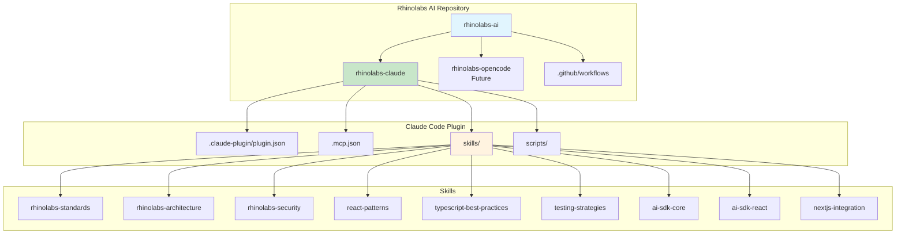
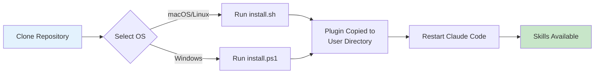
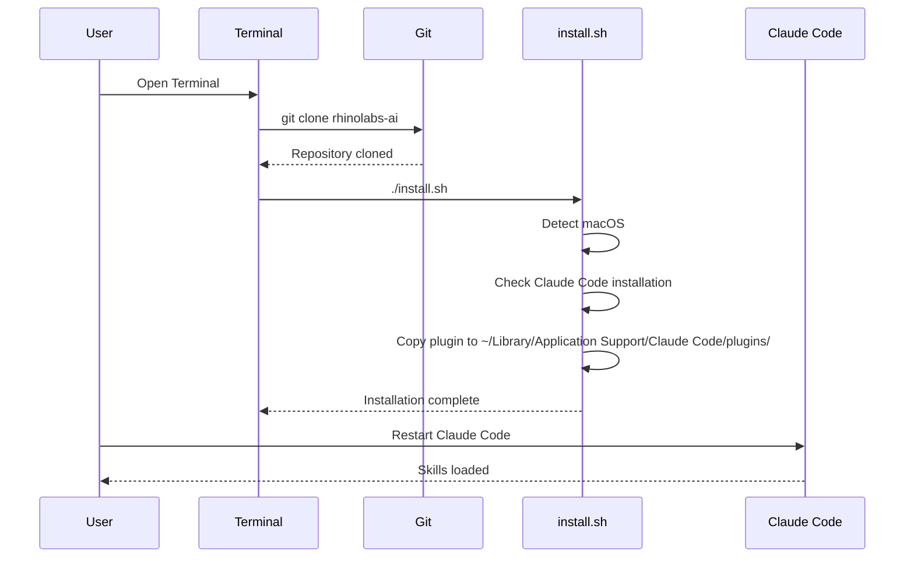
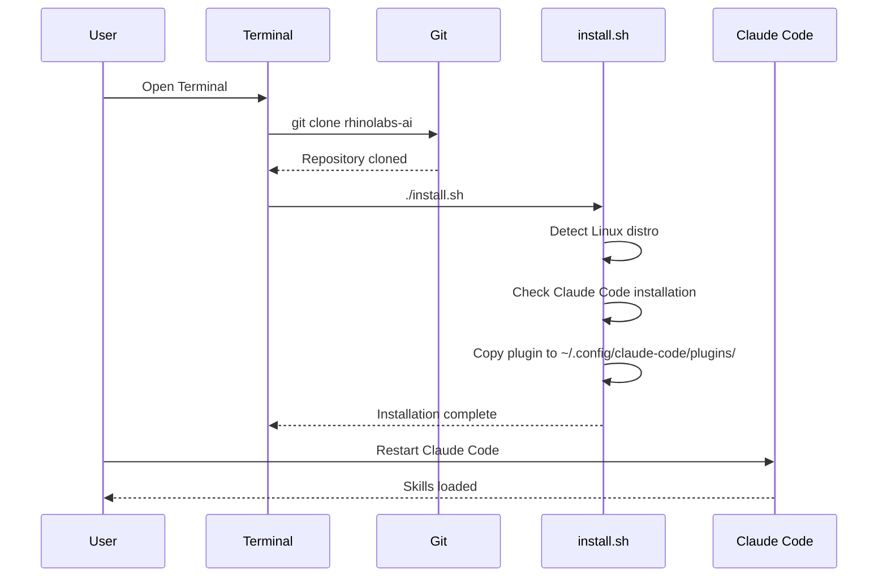
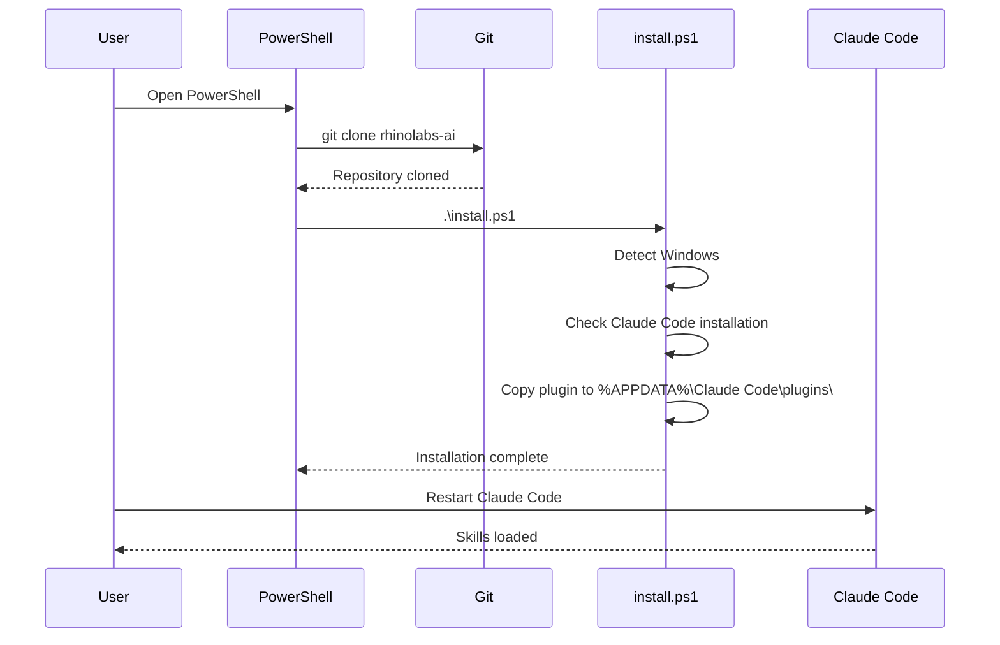
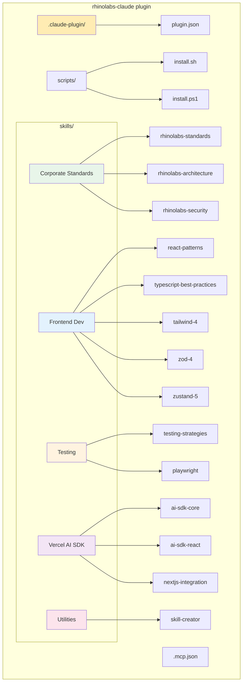
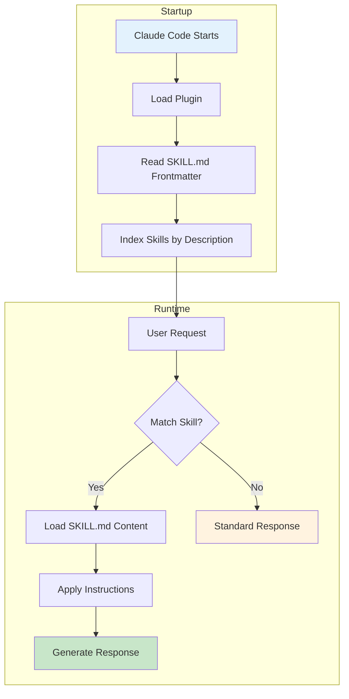
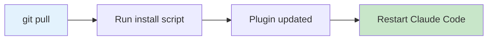
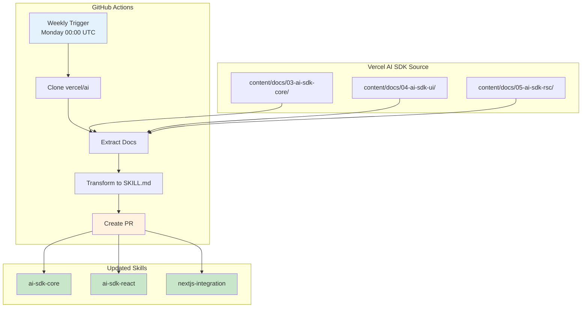

# Rhinolabs AI Configuration

Enterprise-grade configuration solution for AI-powered development tools, starting with Claude Code.

## Overview

This repository provides a centralized, multi-OS compatible configuration system for AI development tools used at Rhinolabs. It ensures consistent coding standards, best practices, and architectural patterns across all development teams.

## Architecture



## Installation Flow



---

## Getting Started

### Prerequisites

Before installing the Rhinolabs Claude plugin, ensure you have:

| Requirement | Description |
|-------------|-------------|
| Claude Code | Installed and configured on your system |
| Git | For cloning the repository |
| Terminal | Bash (macOS/Linux) or PowerShell (Windows) |

### Step-by-Step Installation

---

## macOS Installation



### Steps

**1. Open Terminal**

Press `Cmd + Space`, type "Terminal", and press Enter.

**2. Clone the repository**

```bash
git clone https://github.com/rhinolabs/rhinolabs-ai.git
```

**3. Navigate to scripts directory**

```bash
cd rhinolabs-ai/rhinolabs-claude/scripts
```

**4. Make the script executable**

```bash
chmod +x install.sh
```

**5. Run the installer**

```bash
./install.sh
```

**6. Verify installation**

The script will display:
```
✅ Installation successful!
Plugin installed at: ~/Library/Application Support/Claude Code/plugins/rhinolabs-claude
```

**7. Restart Claude Code**

Close and reopen Claude Code to load the new skills.

**8. Verify skills are loaded**

In Claude Code, the skills will be automatically available based on context.

---

## Linux Installation (Ubuntu/Arch)



### Steps

**1. Open Terminal**

- Ubuntu: Press `Ctrl + Alt + T`
- Arch: Use your preferred terminal emulator

**2. Clone the repository**

```bash
git clone https://github.com/rhinolabs/rhinolabs-ai.git
```

**3. Navigate to scripts directory**

```bash
cd rhinolabs-ai/rhinolabs-claude/scripts
```

**4. Make the script executable**

```bash
chmod +x install.sh
```

**5. Run the installer**

```bash
./install.sh
```

**6. Verify installation**

The script will display:
```
✅ Installation successful!
Plugin installed at: ~/.config/claude-code/plugins/rhinolabs-claude
```

**7. Restart Claude Code**

```bash
# If running in terminal, exit and restart
claude
```

**8. Verify skills are loaded**

In Claude Code, the skills will be automatically available based on context.

---

## Windows Installation



### Steps

**1. Open PowerShell**

Press `Win + X` and select "Windows PowerShell" or "Terminal".

**2. Clone the repository**

```powershell
git clone https://github.com/rhinolabs/rhinolabs-ai.git
```

**3. Navigate to scripts directory**

```powershell
cd rhinolabs-ai\rhinolabs-claude\scripts
```

**4. Run the installer**

```powershell
.\install.ps1
```

> **Note**: If you get an execution policy error, run:
> ```powershell
> Set-ExecutionPolicy -ExecutionPolicy RemoteSigned -Scope CurrentUser
> ```

**5. Verify installation**

The script will display:
```
✅ Installation successful!
Plugin installed at: C:\Users\<username>\AppData\Roaming\Claude Code\plugins\rhinolabs-claude
```

**6. Restart Claude Code**

Close and reopen Claude Code to load the new skills.

**7. Verify skills are loaded**

In Claude Code, the skills will be automatically available based on context.

---

## Plugin Structure



```
rhinolabs-claude/
├── .claude-plugin/
│   └── plugin.json              # Plugin metadata
├── .mcp.json                    # MCP server configuration
├── scripts/
│   ├── install.sh               # macOS/Linux installer
│   └── install.ps1              # Windows installer
└── skills/
    ├── rhinolabs-standards/     # Corporate development standards
    ├── rhinolabs-architecture/  # Architecture patterns
    ├── rhinolabs-security/      # Security requirements
    ├── react-patterns/          # React best practices
    ├── typescript-best-practices/ # TypeScript guidelines
    ├── tailwind-4/              # Tailwind CSS v4
    ├── zod-4/                   # Zod validation
    ├── zustand-5/               # Zustand state management
    ├── testing-strategies/      # Testing approaches
    ├── playwright/              # Playwright E2E testing
    ├── ai-sdk-core/             # Vercel AI SDK core (auto-synced)
    ├── ai-sdk-react/            # Vercel AI SDK React (auto-synced)
    ├── nextjs-integration/      # Next.js AI patterns (auto-synced)
    └── skill-creator/           # Skill creation utility
        ├── SKILL.md
        └── assets/
            └── SKILL-TEMPLATE.md
```

---

## Available Skills

### Corporate Standards

| Skill | Description | Use Case |
|-------|-------------|----------|
| `rhinolabs-standards` | Corporate development standards | Code quality, testing, documentation |
| `rhinolabs-architecture` | Architecture patterns | System design, project structure |
| `rhinolabs-security` | Security requirements | Auth, encryption, compliance |

### Frontend Development

| Skill | Description | Use Case |
|-------|-------------|----------|
| `react-patterns` | React best practices | Components, hooks, state management |
| `typescript-best-practices` | TypeScript guidelines | Types, generics, type guards |
| `tailwind-4` | Tailwind CSS v4 patterns | Utility-first styling, responsive design |
| `zod-4` | Zod v4 validation | Schema validation, type inference |
| `zustand-5` | Zustand v5 state management | Global state, stores, actions |

### Testing

| Skill | Description | Use Case |
|-------|-------------|----------|
| `testing-strategies` | Testing approaches | Unit, integration, E2E tests |
| `playwright` | Playwright E2E testing | Browser automation, E2E tests |

### Vercel AI SDK (Auto-synced)

| Skill | Description | Use Case |
|-------|-------------|----------|
| `ai-sdk-core` | Vercel AI SDK core | generateText, streamText |
| `ai-sdk-react` | Vercel AI SDK React | useChat, useCompletion hooks |
| `nextjs-integration` | Next.js AI patterns | Server actions, route handlers |

### Utilities

| Skill | Description | Use Case |
|-------|-------------|----------|
| `skill-creator` | Create new skills | Skill templates, best practices |

---

## How Skills Work



Skills are automatically triggered based on context. Each skill has:

1. **Frontmatter** (YAML): Name and description for indexing
2. **Body** (Markdown): Instructions Claude follows when activated

Example skill structure:
```yaml
---
name: react-patterns
description: Use when writing React components, hooks, or discussing React architecture.
---

# React Patterns and Best Practices

## Component Composition
...
```

---

## Installation Paths by OS

| OS | Plugin Installation Path |
|----|--------------------------|
| macOS | `~/Library/Application Support/Claude Code/plugins/rhinolabs-claude/` |
| Linux | `~/.config/claude-code/plugins/rhinolabs-claude/` |
| Windows | `%APPDATA%\Claude Code\plugins\rhinolabs-claude\` |

---

## Updating the Plugin



### macOS/Linux

```bash
cd rhinolabs-ai
git pull origin main
cd rhinolabs-claude/scripts
./install.sh
```

### Windows

```powershell
cd rhinolabs-ai
git pull origin main
cd rhinolabs-claude\scripts
.\install.ps1
```

---

## Automatic Vercel AI SDK Sync



The Vercel AI SDK skills are automatically synchronized from the [official Vercel AI repository](https://github.com/vercel/ai).

### How it works

1. **Schedule**: Every Monday at 00:00 UTC (or manual trigger)
2. **Source**: Clones `vercel/ai` repository
3. **Extraction**: Pulls docs from `content/docs/` folders
4. **Transformation**: Converts MDX to SKILL.md with proper frontmatter
5. **Review**: Creates a Pull Request for team review

### Synced Skills

| Skill | Source | Content |
|-------|--------|---------|
| `ai-sdk-core` | `03-ai-sdk-core/` | generateText, streamText, core patterns |
| `ai-sdk-react` | `04-ai-sdk-ui/` | useChat, useCompletion hooks |
| `nextjs-integration` | `05-ai-sdk-rsc/` | RSC, Server Actions, streaming |

### Manual Sync

To trigger a manual sync:

1. Go to **Actions** tab in GitHub
2. Select **Sync Vercel AI SDK Skills**
3. Click **Run workflow**

---

## Troubleshooting

### Plugin not loading

1. Verify installation path exists
2. Check `.claude-plugin/plugin.json` exists in the plugin directory
3. Restart Claude Code completely

### Permission denied (macOS/Linux)

```bash
chmod +x install.sh
```

### Execution policy error (Windows)

```powershell
Set-ExecutionPolicy -ExecutionPolicy RemoteSigned -Scope CurrentUser
```

### Skills not triggering

- Skills activate based on context (keywords in your request)
- Try being more specific: "Using React patterns, create a component..."

---

## Uninstalling

### macOS

```bash
rm -rf ~/Library/Application\ Support/Claude\ Code/plugins/rhinolabs-claude
```

### Linux

```bash
rm -rf ~/.config/claude-code/plugins/rhinolabs-claude
```

### Windows

```powershell
Remove-Item -Recurse -Force "$env:APPDATA\Claude Code\plugins\rhinolabs-claude"
```

---

## Documentation

- [Installation Guide](docs/INSTALLATION.md)
- [Skill Management Guidelines](docs/SKILL_GUIDELINES.md) - How skills work and conflict resolution
- [Security Policy](docs/SECURITY_POLICY.md) - Organizational security policies, incident response, compliance
- [MCP Integration](docs/MCP_INTEGRATION.md) - Technical MCP details
- [MCP Centralized Config](docs/MCP_CENTRALIZED_CONFIG.md) - Using mcp-toolkit as source of truth
- [Multi-OS Support](docs/MULTI_OS_SUPPORT.md)

---

## Support

For issues or questions:
- Internal: Contact the DevOps team
- Documentation: Check the `docs/` directory

---

## License

Proprietary - Rhinolabs Internal Use Only

---

**Version**: 1.0.0
**Last Updated**: 2026-01-23
