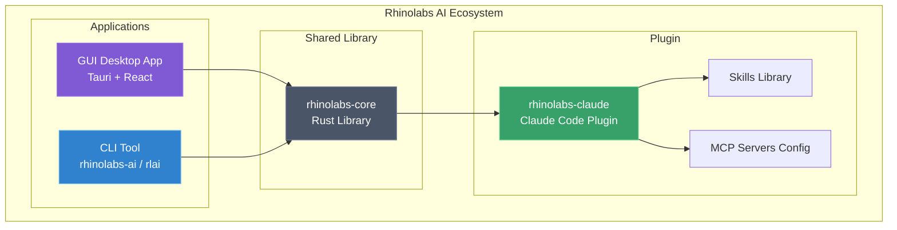
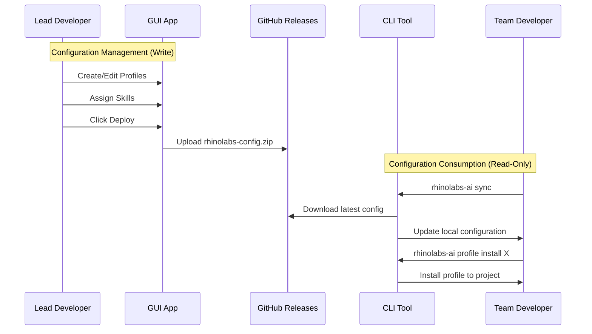
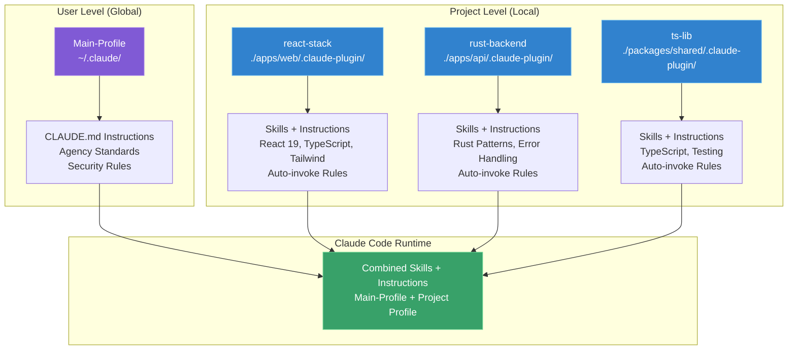
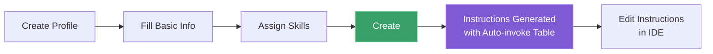
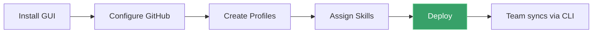
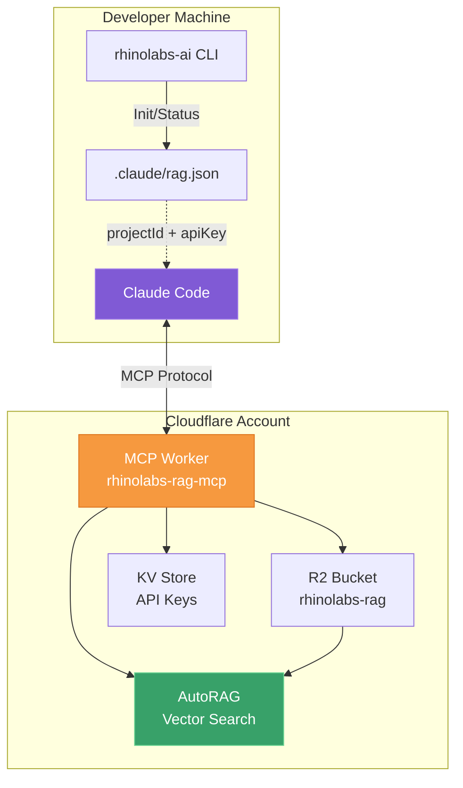
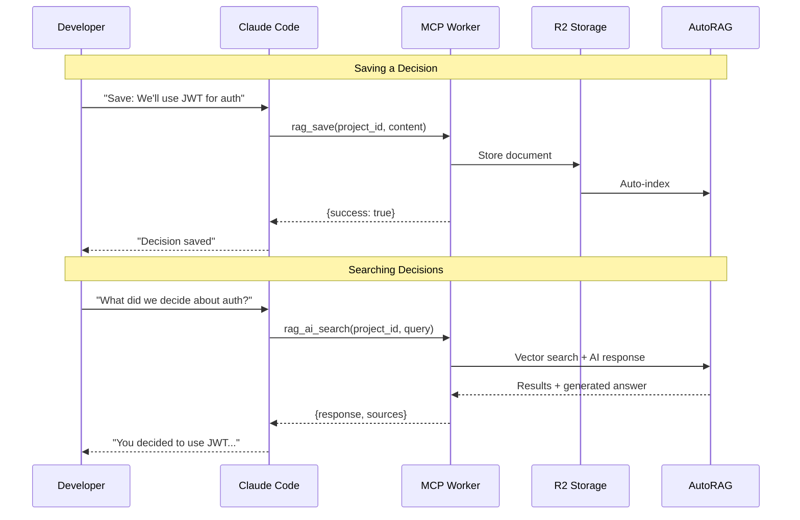
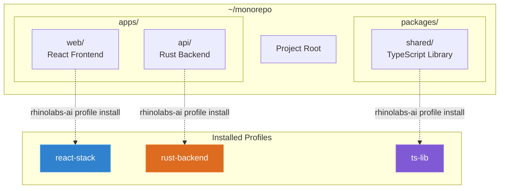
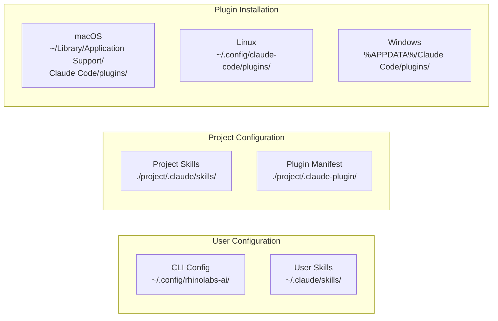
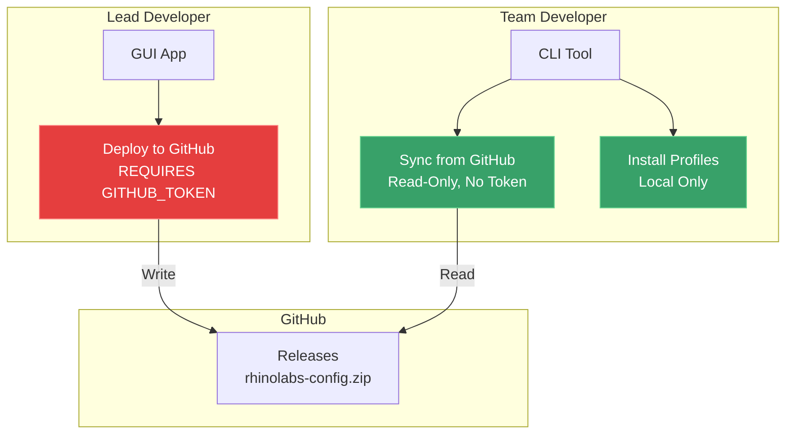

# Rhinolabs AI

Enterprise-grade skill, profile, and configuration management for AI coding assistants. Supports deploying to Claude Code, Amp, Antigravity, and OpenCode.

## Overview

Rhinolabs AI provides a complete solution for standardizing AI coding assistants across development teams:

- **Plugin**: Curated skills for consistent coding standards
- **CLI**: Command-line tool for profile installation and team sync
- **GUI**: Desktop application for plugin management (lead developers)
- **Profiles**: Organize skills into reusable bundles (user-level and project-level)
- **Deploy/Sync**: Distribute configurations across your team via GitHub releases
- **Multi-Target**: Deploy skills and instructions to Claude Code, Amp, Antigravity, and OpenCode via `--target` flag

## System Architecture



## Deploy & Sync Flow

The system separates concerns between lead developers (configuration management) and team developers (consumption):



## Profiles System

Profiles organize skills AND instructions into reusable bundles that can be applied at different scopes:



### Profile Components

Each profile contains:

- **Skills**: Reusable coding patterns and standards (SKILL.md files)
- **Instructions**: Custom CLAUDE.md content with rules, code standards, and auto-invoke table
- **Auto-invoke Rules**: Define when each skill should be automatically loaded

### User Profile (Main-Profile)

| Aspect           | Description                           |
| ---------------- | ------------------------------------- |
| **Scope**        | Applies to ALL projects               |
| **Location**     | `~/.claude/`                          |
| **Purpose**      | Agency-wide standards, security rules |
| **Instructions** | Shared CLAUDE.md (editable via GUI)   |
| **Installation** | Auto-prompted on first sync           |

### Project Profiles

| Aspect           | Description                                               |
| ---------------- | --------------------------------------------------------- |
| **Scope**        | Applies only to specific project                          |
| **Location**     | `<project>/.claude-plugin/`                               |
| **Purpose**      | Tech-stack specific skills + instructions                 |
| **Instructions** | Generated with auto-invoke table based on assigned skills |
| **Installation** | Manual via `rhinolabs-ai profile install`                 |

### Profile Creation Flow



When creating a profile with skills, the instructions template is automatically generated with:

- Project context and rules
- Code standards
- **Skills Auto-invoke Table** populated with assigned skills

## Quick Start

### For Team Developers

```bash
# Option 1: Download from releases
# Go to the Releases page and download the binary for your platform

# Option 2: Build from source
git clone <repo-url>
cd rhinolabs-ai/cli
cargo build --release
# Binary at: target/release/rhinolabs-ai

# Option 3: Homebrew (requires tap to be configured)
# brew tap <owner>/tap
# brew install rhinolabs-ai
```

Once installed:

```bash
# 1. Run any command (auto-syncs configuration on first run)
rhinolabs-ai profile list

# 2. Install Main-Profile (user-level, applies to all projects)
# (Prompted automatically on first sync)

# 3. Install project-specific profile
cd ~/your-project
rhinolabs-ai profile install react-stack
```

### For Lead Developers



1. Download and install the GUI from the [Releases](../../releases) page
2. Configure GitHub repository in **Project Settings**
3. Create profiles and assign skills
4. Click **Deploy** to publish configuration

## CLI Commands

```bash
# Aliases: rhinolabs-ai or rlai

# Configuration sync (auto-runs on first command of terminal session)
rhinolabs-ai sync                    # Manual sync from GitHub

# Profile management
rhinolabs-ai profile list            # List all profiles
rhinolabs-ai profile show <id>       # Show profile details
rhinolabs-ai profile install <name>  # Install profile (default: Claude Code)
rhinolabs-ai profile install <name> -t amp          # Install for Amp
rhinolabs-ai profile install <name> -t amp -t claude-code  # Multiple targets
rhinolabs-ai profile install <name> -t all          # All targets
rhinolabs-ai profile install <name> -P /path        # Install to specific path
rhinolabs-ai profile update          # Update installed profile
rhinolabs-ai profile update -t amp   # Update for specific target
rhinolabs-ai profile uninstall       # Remove profile from current directory
rhinolabs-ai profile uninstall -t amp  # Uninstall only Amp artifacts

# Plugin management
rhinolabs-ai install                 # Install base plugin
rhinolabs-ai update                  # Update plugin
rhinolabs-ai uninstall               # Remove plugin
rhinolabs-ai status                  # Show installation status
rhinolabs-ai doctor                  # Run diagnostics

# MCP configuration
rhinolabs-ai sync-mcp                # Sync MCP servers from source

# RAG (Project Memory)
rhinolabs-ai rag init --project <id> --api-key <key>  # Initialize RAG
rhinolabs-ai rag status              # Show RAG status
rhinolabs-ai rag create-key --name "Team"  # Create API key (admin)
rhinolabs-ai rag list-keys           # List API keys (admin)
rhinolabs-ai rag remove              # Remove RAG from project
```

## RAG (Project Memory)

RAG provides per-project memory capabilities, allowing Claude Code to save and retrieve architectural decisions, context, and knowledge.



### RAG Architecture Flow



### RAG Setup

```bash
# 1. Admin creates API key (one time)
rhinolabs-ai rag set-admin-key <admin-secret>
rhinolabs-ai rag create-key --name "Backend Team"
# → API Key: rl_abc123...

# 2. Initialize RAG in project
cd my-project
rhinolabs-ai rag init --project my-project --api-key rl_abc123...

# 3. Claude Code automatically uses RAG tools
# - Ask Claude to save decisions
# - Ask Claude about previous decisions
```

### MCP Tools

| Tool | Description |
|------|-------------|
| `rag_save` | Save document to project RAG |
| `rag_search` | Vector similarity search |
| `rag_ai_search` | AI-powered search with generated answer |
| `rag_list_documents` | List all documents |
| `rag_delete_document` | Delete a document |
| `rag_project_info` | Get project statistics |

## Monorepo Example



```bash
cd ~/monorepo

# Install different profiles for each subproject
rhinolabs-ai profile install react-stack -P ./apps/web
rhinolabs-ai profile install rust-backend -P ./apps/api
rhinolabs-ai profile install ts-lib -P ./packages/shared

# Claude Code automatically combines:
# - Main-Profile (user-level) + Project Profile (per directory)
```

## Installation Paths



| Component        | Path                                                                  |
| ---------------- | --------------------------------------------------------------------- |
| CLI Config       | `~/.config/rhinolabs-ai/`                                             |
| User Skills      | `~/.claude/skills/`                                                   |
| Project Skills   | `<project>/.claude/skills/`                                           |
| Plugin (macOS)   | `~/Library/Application Support/Claude Code/plugins/rhinolabs-claude/` |
| Plugin (Linux)   | `~/.config/claude-code/plugins/rhinolabs-claude/`                     |
| Plugin (Windows) | `%APPDATA%\Claude Code\plugins\rhinolabs-claude\`                     |

## Security Model



- **GUI (Lead Devs)**: Full access - create, edit, deploy configurations
- **CLI (Team Devs)**: Read-only - sync and install, cannot modify shared config
- **GITHUB_TOKEN**: Only required for deploy (GUI), not for sync (CLI)

## Project Structure

```
rhinolabs-ai/
├── cli/                    # Rust CLI (rhinolabs-ai, rlai)
├── core/                   # Shared Rust library
├── gui/                    # Tauri desktop app (React + Rust)
├── rhinolabs-claude/       # Base plugin with skills
└── docs/                   # Documentation
```

## Development

### Prerequisites

- Rust 1.70+
- Node.js 18+
- pnpm (for GUI)

### Building

```bash
# CLI
cd cli && cargo build --release

# GUI
cd gui && pnpm install && pnpm tauri build

# Core library
cd core && cargo build
```

### Testing

```bash
# Unit tests
cargo test --workspace

# GUI E2E tests
cd gui/tests && pnpm test
```

## Documentation

- [Architecture](ARCHITECTURE.md) - System design and data flow
- [CLI Guide](cli/README.md) - Detailed CLI documentation
- [GUI Guide](gui/README.md) - Desktop app documentation
- [Plugin Structure](rhinolabs-claude/README.md) - Skills and plugin details

## Support

- Issues: [GitHub Issues](../../issues)
- Internal: Contact DevOps team

## License

Proprietary - Rhinolabs Internal Use Only

---

**Version**: 0.1.0
**Last Updated**: 2026-02-05
