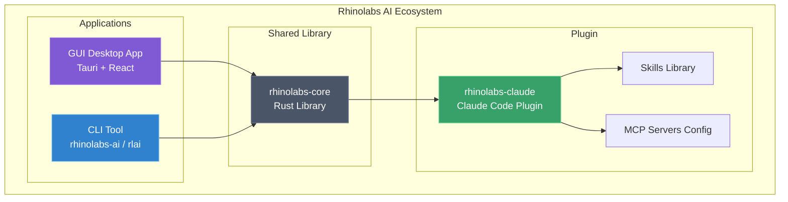
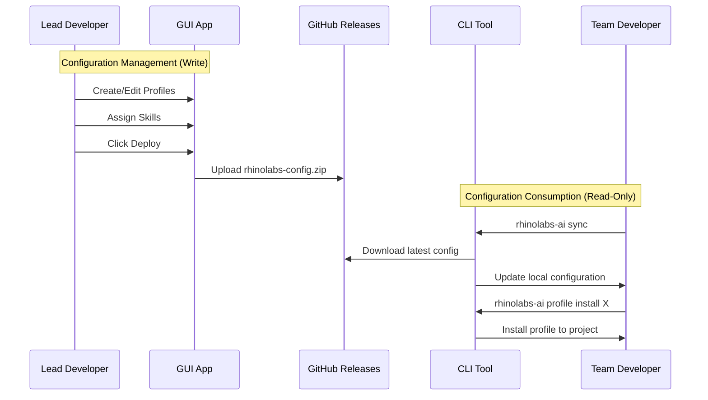
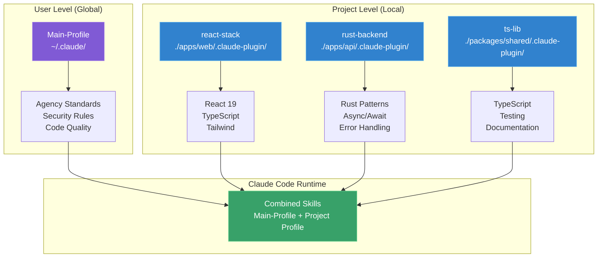
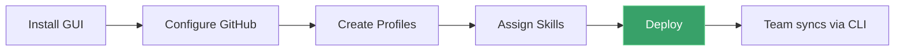
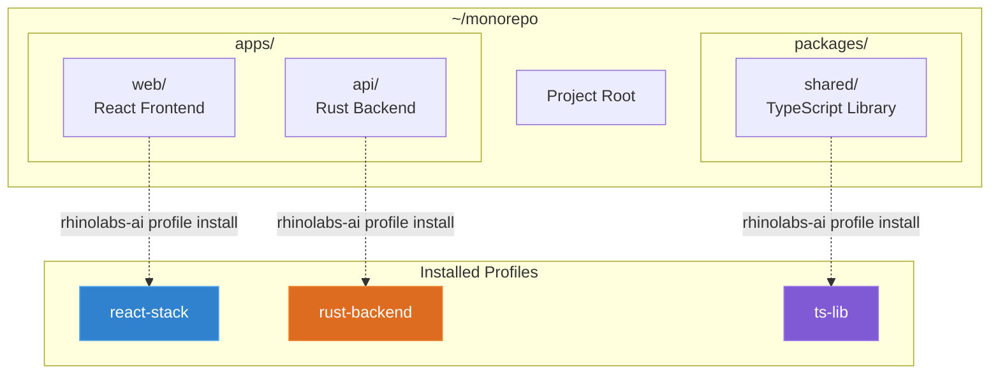
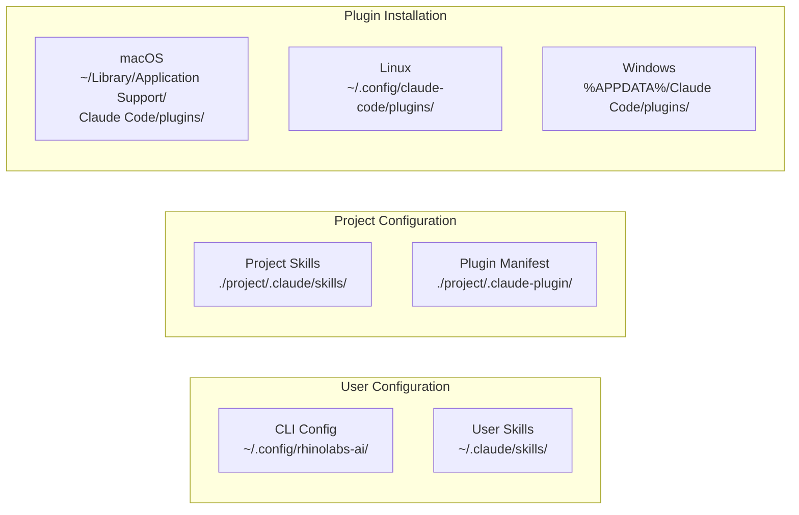
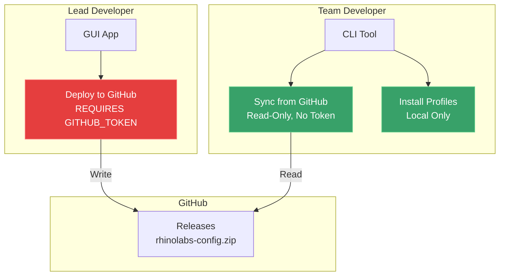

# Rhinolabs AI

Enterprise-grade plugin and configuration management system for Claude Code.

## Overview

Rhinolabs AI provides a complete solution for standardizing Claude Code across development teams:

- **Plugin**: Curated skills for consistent coding standards
- **CLI**: Command-line tool for profile installation and team sync
- **GUI**: Desktop application for plugin management (lead developers)
- **Profiles**: Organize skills into reusable bundles (user-level and project-level)
- **Deploy/Sync**: Distribute configurations across your team via GitHub releases

## System Architecture



## Deploy & Sync Flow

The system separates concerns between lead developers (configuration management) and team developers (consumption):



## Profiles System

Profiles organize skills into reusable bundles that can be applied at different scopes:



### User Profile (Main-Profile)

| Aspect | Description |
|--------|-------------|
| **Scope** | Applies to ALL projects |
| **Location** | `~/.claude/` |
| **Purpose** | Agency-wide standards, security rules |
| **Installation** | Auto-prompted on first sync |

### Project Profiles

| Aspect | Description |
|--------|-------------|
| **Scope** | Applies only to specific project |
| **Location** | `<project>/.claude-plugin/` |
| **Purpose** | Tech-stack specific skills |
| **Installation** | Manual via `rhinolabs-ai profile install` |

## Quick Start

### For Team Developers

```bash
# 1. Install CLI via Homebrew
brew tap rhinolabs/tap
brew install rhinolabs-ai

# 2. Run any command (auto-syncs configuration on first run)
rhinolabs-ai profile list

# 3. Install Main-Profile (user-level, applies to all projects)
# (Prompted automatically on first sync)

# 4. Install project-specific profile
cd ~/your-project
rhinolabs-ai profile install react-stack
```

### For Lead Developers



1. Download and install the GUI from [Releases](https://github.com/rhinolabs/rhinolabs-ai/releases)
2. Configure GitHub repository in **Project Settings**
3. Create profiles and assign skills
4. Click **Deploy** to publish configuration

## CLI Commands

```bash
# Aliases: rhinolabs-ai or rlai

# Configuration sync (auto-runs on first command of terminal session)
rhinolabs-ai sync                    # Manual sync from GitHub

# Profile management
rhinolabs-ai profile list            # List all profiles
rhinolabs-ai profile show <id>       # Show profile details
rhinolabs-ai profile install <name>  # Install profile (current directory)
rhinolabs-ai profile install <name> -P /path  # Install to specific path
rhinolabs-ai profile update          # Update installed profile
rhinolabs-ai profile uninstall       # Remove profile from current directory

# Plugin management
rhinolabs-ai install                 # Install base plugin
rhinolabs-ai update                  # Update plugin
rhinolabs-ai uninstall               # Remove plugin
rhinolabs-ai status                  # Show installation status
rhinolabs-ai doctor                  # Run diagnostics

# MCP configuration
rhinolabs-ai sync-mcp                # Sync MCP servers from source
```

## Monorepo Example



```bash
cd ~/monorepo

# Install different profiles for each subproject
rhinolabs-ai profile install react-stack -P ./apps/web
rhinolabs-ai profile install rust-backend -P ./apps/api
rhinolabs-ai profile install ts-lib -P ./packages/shared

# Claude Code automatically combines:
# - Main-Profile (user-level) + Project Profile (per directory)
```

## Installation Paths



| Component | Path |
|-----------|------|
| CLI Config | `~/.config/rhinolabs-ai/` |
| User Skills | `~/.claude/skills/` |
| Project Skills | `<project>/.claude/skills/` |
| Plugin (macOS) | `~/Library/Application Support/Claude Code/plugins/rhinolabs-claude/` |
| Plugin (Linux) | `~/.config/claude-code/plugins/rhinolabs-claude/` |
| Plugin (Windows) | `%APPDATA%\Claude Code\plugins\rhinolabs-claude\` |

## Security Model



- **GUI (Lead Devs)**: Full access - create, edit, deploy configurations
- **CLI (Team Devs)**: Read-only - sync and install, cannot modify shared config
- **GITHUB_TOKEN**: Only required for deploy (GUI), not for sync (CLI)

## Project Structure

```
rhinolabs-ai/
├── cli/                    # Rust CLI (rhinolabs-ai, rlai)
├── core/                   # Shared Rust library
├── gui/                    # Tauri desktop app (React + Rust)
├── rhinolabs-claude/       # Base plugin with skills
└── docs/                   # Documentation
```

## Development

### Prerequisites

- Rust 1.70+
- Node.js 18+
- pnpm (for GUI)

### Building

```bash
# CLI
cd cli && cargo build --release

# GUI
cd gui && pnpm install && pnpm tauri build

# Core library
cd core && cargo build
```

### Testing

```bash
# Unit tests
cargo test --workspace

# GUI E2E tests
cd gui/tests && pnpm test
```

## Documentation

- [Architecture](ARCHITECTURE.md) - System design and data flow
- [CLI Guide](cli/README.md) - Detailed CLI documentation
- [GUI Guide](gui/README.md) - Desktop app documentation
- [Plugin Structure](rhinolabs-claude/README.md) - Skills and plugin details

## Support

- Issues: [GitHub Issues](https://github.com/rhinolabs/rhinolabs-ai/issues)
- Internal: Contact DevOps team

## License

Proprietary - Rhinolabs Internal Use Only

---

**Version**: 2.1.0
**Last Updated**: 2026-01-28
