# Rhinolabs AI CLI

Command-line interface for managing Rhinolabs AI profiles and plugin configuration.

## Overview

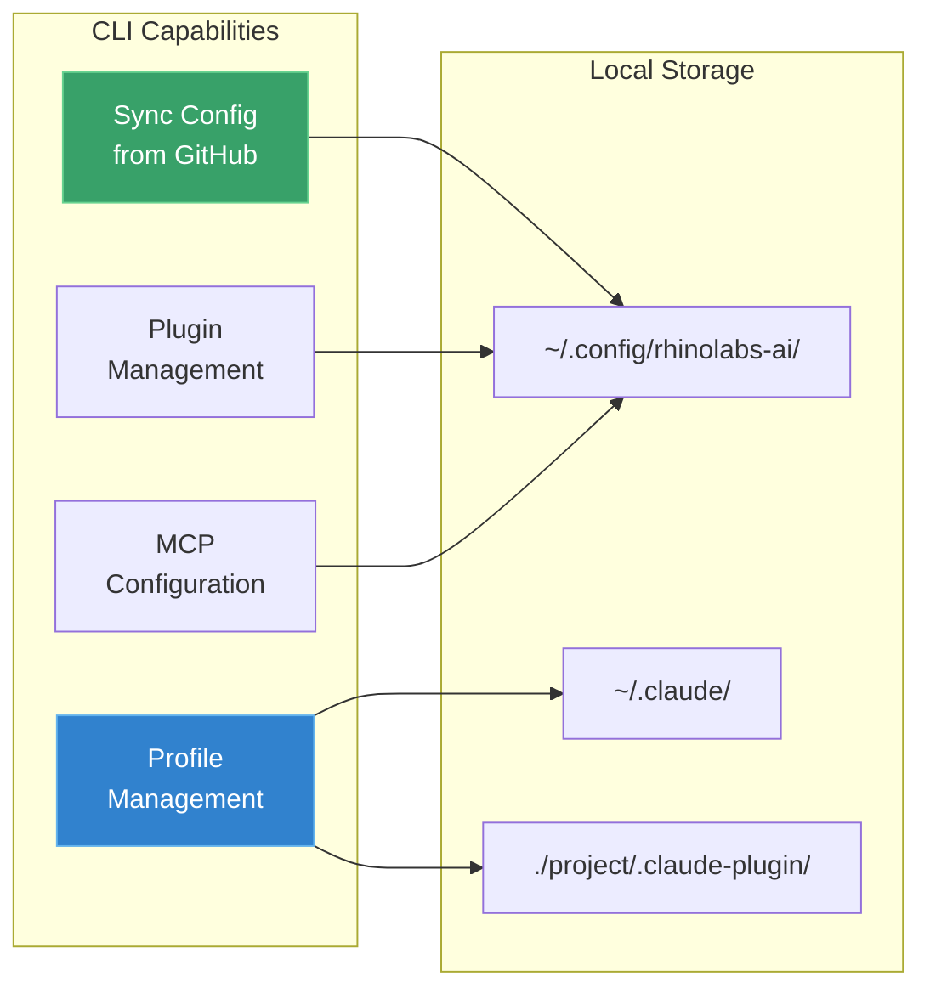

## Installation

### Via Homebrew (Recommended)

```bash
brew tap rhinolabs/tap
brew install rhinolabs-ai
```

### Via Cargo

```bash
cargo install --path .
```

### From Source

```bash
cd cli
cargo build --release
# Binary at: target/release/rhinolabs-ai
```

## Command Structure

```mermaid
graph TB
    CLI[rhinolabs-ai / rlai]

    CLI --> SYNC[sync]
    CLI --> PROFILE[profile]
    CLI --> SKILL[skill]
    CLI --> RAG[rag]
    CLI --> INSTALL[install]
    CLI --> UPDATE[update]
    CLI --> UNINSTALL[uninstall]
    CLI --> STATUS[status]
    CLI --> DOCTOR[doctor]
    CLI --> SYNCMCP[sync-mcp]

    PROFILE --> P_LIST[list]
    PROFILE --> P_SHOW[show]
    PROFILE --> P_INST["install [--target]"]
    PROFILE --> P_UPD["update [--target]"]
    PROFILE --> P_UNINST["uninstall [--target]"]

    SKILL --> S_LIST[list]
    SKILL --> S_SHOW[show]
    SKILL --> S_CREATE[create]
    SKILL --> S_SETCAT[set-category]

    RAG --> R_INIT[init]
    RAG --> R_STATUS[status]
    RAG --> R_REMOVE[remove]
    RAG --> R_CREATE_KEY[create-key]
    RAG --> R_LIST_KEYS[list-keys]
    RAG --> R_SET_ADMIN[set-admin-key]

    style CLI fill:#805ad5,stroke:#9f7aea,color:#fff
    style SYNC fill:#38a169,stroke:#68d391,color:#fff
    style PROFILE fill:#3182ce,stroke:#63b3ed,color:#fff
    style SKILL fill:#dd6b20,stroke:#ed8936,color:#fff
    style RAG fill:#38a169,stroke:#68d391,color:#fff
```

## Auto-Sync Feature

On the first command of each terminal session, the CLI automatically syncs configuration from GitHub.

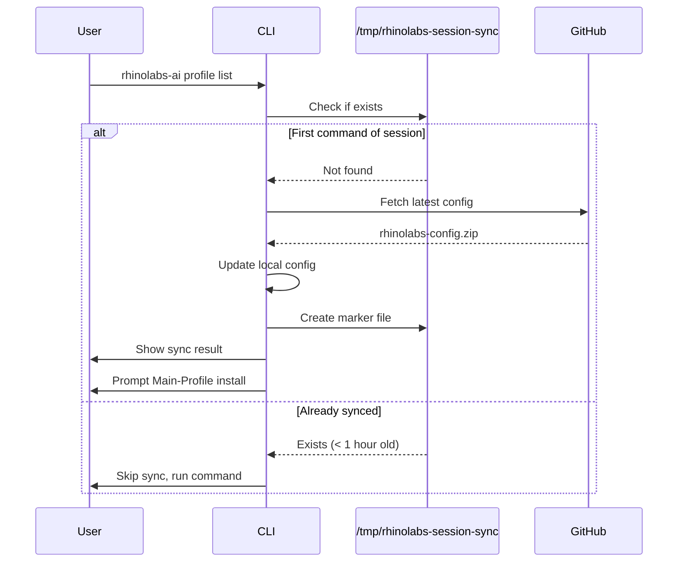

```bash
# First command triggers auto-sync
rhinolabs-ai profile list

# Output:
# ━━━ Configuration Sync ━━━
# Checking for updates...
# ✓ Configuration synced: v1.2.0
#
# ━━━ Main-Profile Setup ━━━
# Main-Profile is not installed in your user memory (~/.claude/).
# Install Main-Profile now? [Y/n]:
```

## Commands Reference

### Profile Management

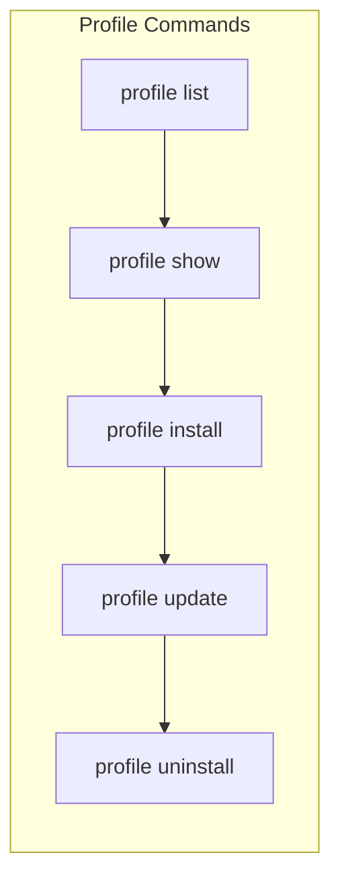

```bash
# List all available profiles
rhinolabs-ai profile list

# Show profile details
rhinolabs-ai profile show <profile-id>

# Install profile to current directory (default target: Claude Code)
rhinolabs-ai profile install <profile-name>

# Install profile for a specific target
rhinolabs-ai profile install <profile-name> --target amp

# Install for multiple targets
rhinolabs-ai profile install <profile-name> -t amp -t claude-code

# Install for all supported targets
rhinolabs-ai profile install <profile-name> --target all

# Install profile to specific path
rhinolabs-ai profile install <profile-name> -P /path/to/project

# Update installed profile (detects profile automatically)
rhinolabs-ai profile update

# Update specific profile for a target
rhinolabs-ai profile update <profile-name> --target amp

# Uninstall profile from current directory
rhinolabs-ai profile uninstall

# Uninstall only specific target artifacts
rhinolabs-ai profile uninstall --target amp

# Uninstall from specific path
rhinolabs-ai profile uninstall -P /path/to/project
```

**Supported targets**: `claude-code` (default), `amp`, `antigravity`, `open-code`, `all`

| Target | Skills Dir | Instructions File | Config Dir |
|--------|-----------|-------------------|------------|
| `claude-code` | `.claude/skills/` | `CLAUDE.md` | `.claude/` |
| `amp` | `.agents/skills/` | `AGENTS.md` | `.agents/` |
| `antigravity` | `.agent/skills/` | `GEMINI.md` | `.agent/` |
| `open-code` | `.opencode/skills/` | `opencode.json` | `.opencode/` |

### Skill Management

```bash
# List all skills (grouped by category)
rhinolabs-ai skill list

# Show skill details
rhinolabs-ai skill show <skill-id>

# Create a new custom skill
rhinolabs-ai skill create --id my-skill --name "My Skill" --category frontend

# Create with description
rhinolabs-ai skill create --id my-skill --name "My Skill" --category frontend --description "Skill description"

# Change skill category
rhinolabs-ai skill set-category <skill-id> <category>

# Available categories: corporate, frontend, testing, ai-sdk, utilities, custom
```

### Configuration Sync

```bash
# Manual sync from GitHub
rhinolabs-ai sync
```

### Plugin Management

```bash
# Install base plugin
rhinolabs-ai install

# Install from local directory (development)
rhinolabs-ai install --local /path/to/rhinolabs-claude

# Update plugin
rhinolabs-ai update

# Uninstall plugin
rhinolabs-ai uninstall

# Show status
rhinolabs-ai status

# Run diagnostics
rhinolabs-ai doctor
```

### MCP Configuration

```bash
# Sync MCP servers from configured source
rhinolabs-ai sync-mcp

# Sync from URL
rhinolabs-ai sync-mcp --url https://config.example.com/mcp.json

# Sync from file
rhinolabs-ai sync-mcp --file ./mcp-config.json

# Dry run (show what would be done)
rhinolabs-ai sync-mcp --dry-run
```

### RAG (Project Memory)

RAG provides per-project memory capabilities. Claude Code can save and retrieve architectural decisions, context, and knowledge through a centralized MCP Worker.

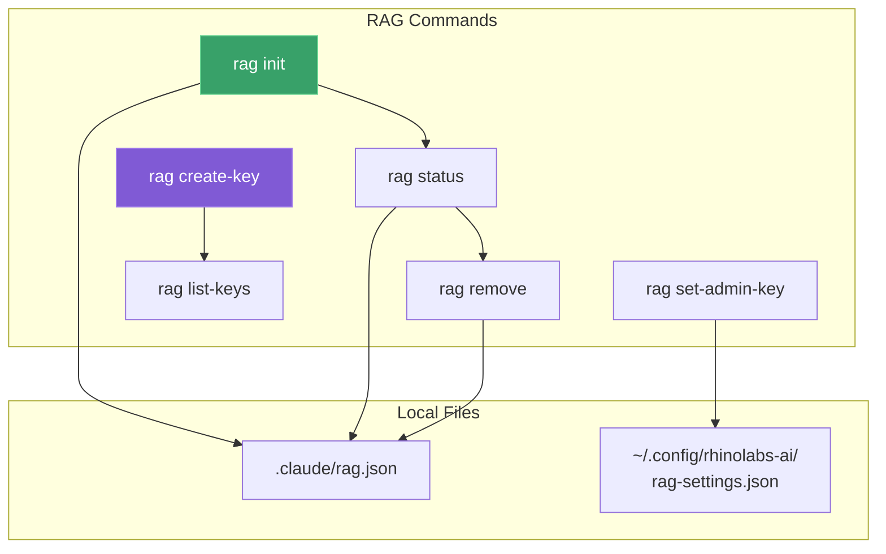

```bash
# Initialize RAG for current project
rhinolabs-ai rag init --project my-project --api-key rl_xxx

# Show RAG status
rhinolabs-ai rag status

# Remove RAG from project
rhinolabs-ai rag remove

# Admin: Set admin key for key management
rhinolabs-ai rag set-admin-key <admin-secret>

# Admin: Create new API key
rhinolabs-ai rag create-key --name "My Team"
rhinolabs-ai rag create-key --name "Client X" --projects project-a,project-b

# Admin: List all API keys
rhinolabs-ai rag list-keys
```

**RAG Setup Flow:**

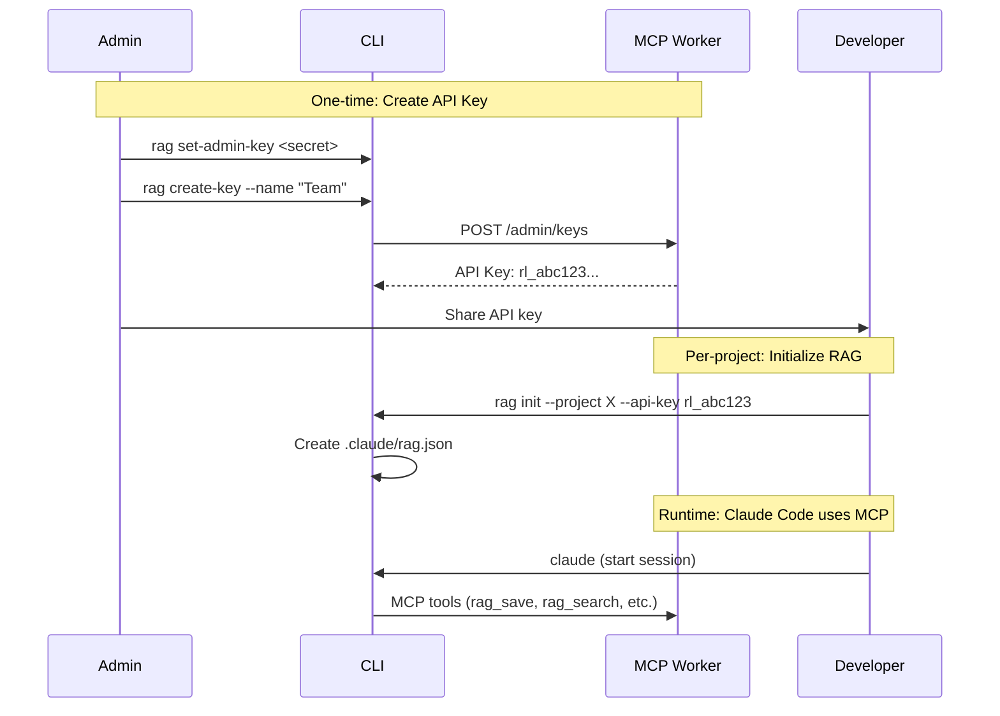

## Profile Installation Flow

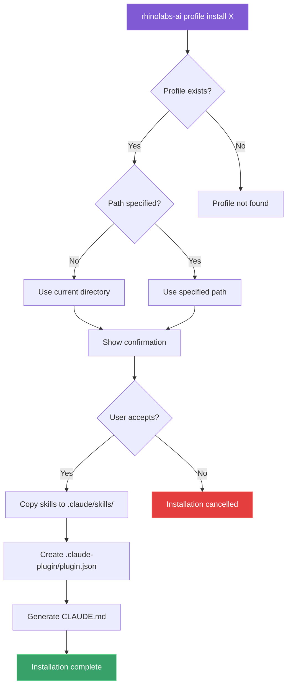

## Profile Types

### User Profile (Main-Profile)

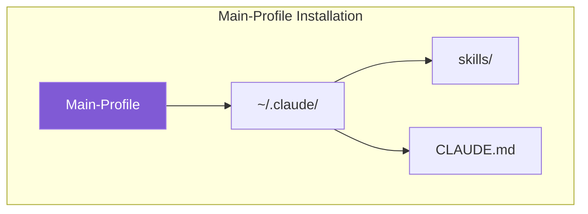

- **Scope**: Applies to ALL projects
- **Location**: `~/.claude/`
- **Purpose**: Agency-wide standards and general skills
- **Installation**: Prompted automatically on first sync

### Project Profiles

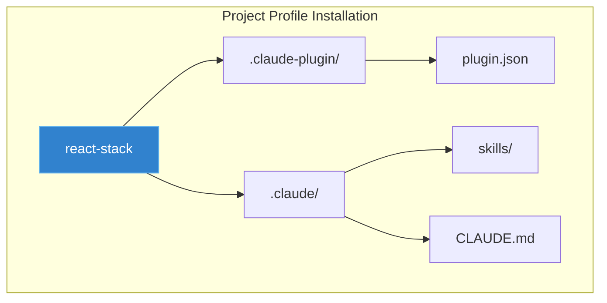

- **Scope**: Applies only to specific project
- **Location**: `<project>/.claude-plugin/`
- **Purpose**: Tech-stack specific skills

## Monorepo Example

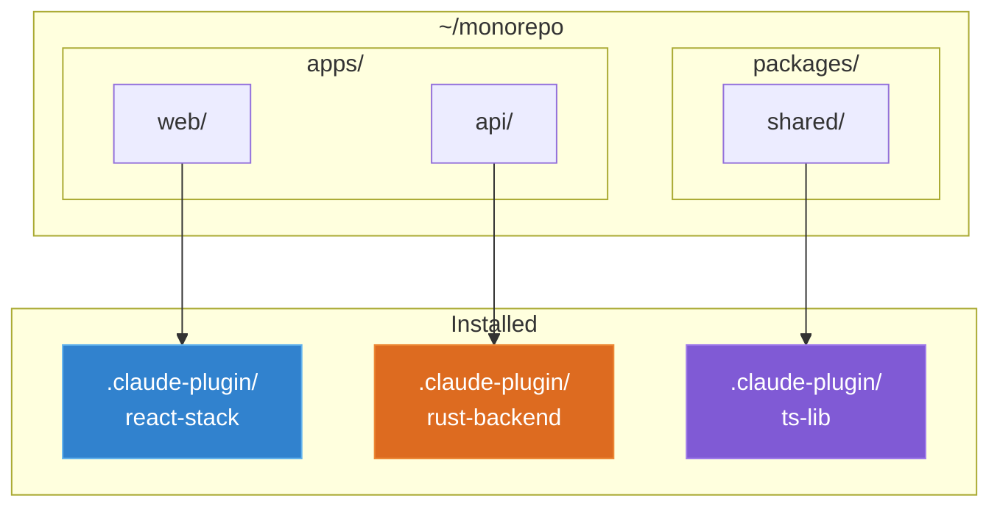

```bash
cd ~/monorepo

# Frontend app (React)
rhinolabs-ai profile install react-stack -P ./apps/web

# Backend API (Rust)
rhinolabs-ai profile install rust-backend -P ./apps/api

# Shared library (TypeScript)
rhinolabs-ai profile install ts-lib -P ./packages/shared
```

## Configuration

Configuration is stored in `~/.config/rhinolabs-ai/`:

```
~/.config/rhinolabs-ai/
├── profiles.json       # Profile definitions (synced from GitHub)
├── skills/             # Skill definitions (synced from GitHub)
├── .project.json       # GitHub repository settings
└── ...
```

## Security Model

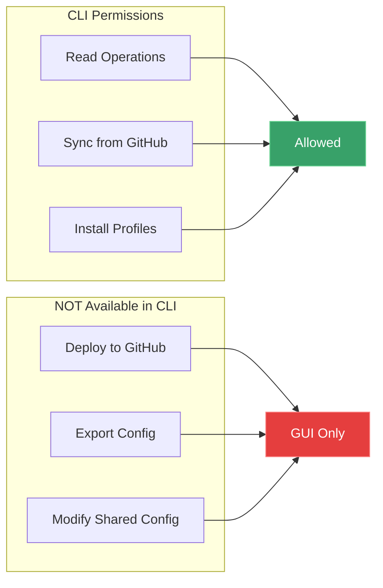

Team developers cannot modify shared configuration - only sync and install locally.

## Troubleshooting

### Sync Failed

```bash
# Check GitHub configuration
rhinolabs-ai doctor

# Verify network connectivity
curl -I https://github.com

# Manual sync with verbose output
rhinolabs-ai sync
```

### Profile Not Found

```bash
# List available profiles
rhinolabs-ai profile list

# Ensure sync has completed
rhinolabs-ai sync
```

### Permission Denied

```bash
# Check installation path permissions
ls -la ~/.claude/
ls -la ~/.config/rhinolabs-ai/
```

## Architecture

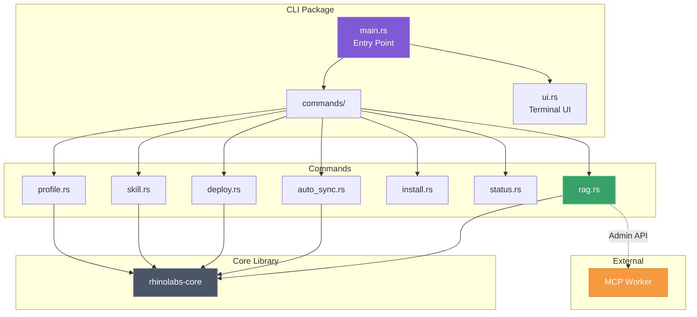

## Development

### Building

```bash
cargo build
```

### Testing

```bash
cargo test
```

### Running Locally

```bash
cargo run -- profile list
cargo run -- sync
```

---

**Version**: 1.1.0
**Last Updated**: 2026-01-29
