# Rhinolabs Core

Shared Rust library providing core functionality for the Rhinolabs AI ecosystem.

## Overview

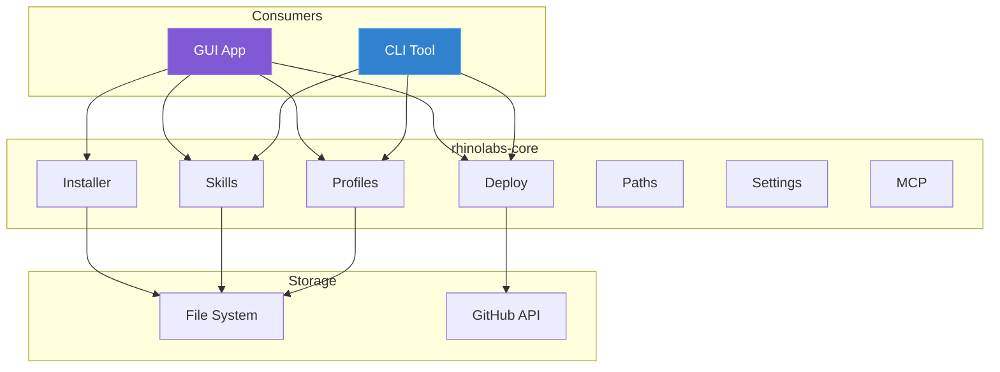

`rhinolabs-core` is used by both the CLI and GUI to ensure consistent behavior across all interfaces.

## Module Architecture

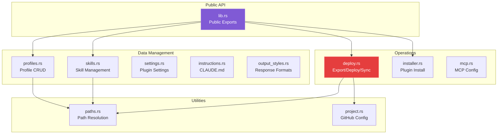

## Modules

### profiles.rs

Profile management, instructions, and installation.

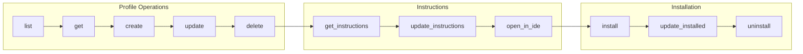

```rust
use rhinolabs_core::{Profiles, ProfileType, CreateProfileInput};

// List all profiles
let profiles = Profiles::list()?;

// Get specific profile
let profile = Profiles::get("react-stack")?;

// Create profile with skills (generates instructions template with auto-invoke table)
let profile = Profiles::create(CreateProfileInput {
    id: "my-profile".to_string(),
    name: "My Profile".to_string(),
    description: "Custom profile".to_string(),
    profile_type: ProfileType::Project,
    skills: vec!["react-19".to_string(), "typescript".to_string()],
    ..Default::default()
})?;

// Profile Instructions
let content = Profiles::get_instructions("react-stack")?;
Profiles::update_instructions("react-stack", "# New Instructions\n...")?;
let path = Profiles::get_instructions_path("react-stack")?;

// Install profile to path
let result = Profiles::install("react-stack", Some(Path::new("./project")))?;

// Update installed profile
let result = Profiles::update_installed("react-stack", Some(Path::new("./project")))?;

// Uninstall profile
Profiles::uninstall(Path::new("./project"))?;
```

**Instructions Generation:**
When creating a profile with skills, instructions are auto-generated with:
- Project context and rules
- Code standards template
- Auto-invoke table populated with assigned skills

### skills.rs

Skill management and retrieval.

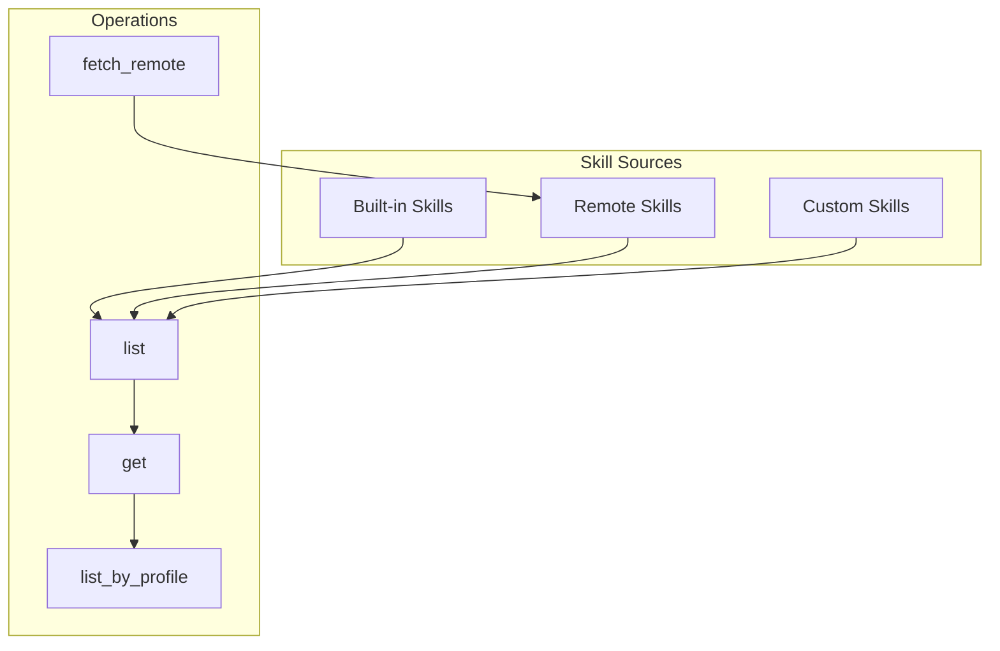

```rust
use rhinolabs_core::Skills;

// List all skills
let skills = Skills::list()?;

// Get skill by ID
let skill = Skills::get("react-19")?;

// List skills by profile
let skills = Skills::list_by_profile("react-stack")?;

// Fetch remote skills
Skills::fetch_remote("anthropic-official")?;
```

### deploy.rs

Configuration export, deploy, and sync.

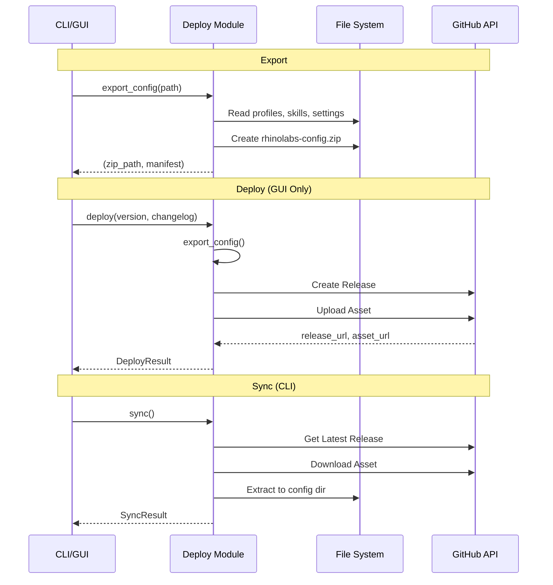

```rust
use rhinolabs_core::Deploy;

// Export configuration to zip
let (zip_path, manifest) = Deploy::export_config(Path::new("./output"))?;

// Deploy to GitHub (requires GITHUB_TOKEN)
let result = Deploy::deploy("1.0.0", "Release notes").await?;

// Sync from GitHub
let result = Deploy::sync().await?;
```

### paths.rs

Cross-platform path resolution.

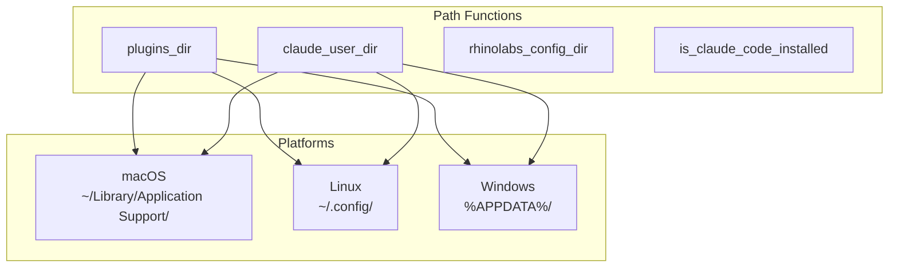

```rust
use rhinolabs_core::Paths;

// Plugin installation path
let plugin_path = Paths::plugins_dir()?;

// User Claude directory
let claude_dir = Paths::claude_user_dir()?;

// Rhinolabs config directory
let config_dir = Paths::rhinolabs_config_dir()?;

// Check if Claude Code is installed
if Paths::is_claude_code_installed() {
    // ...
}
```

### installer.rs

Plugin installation and updates.

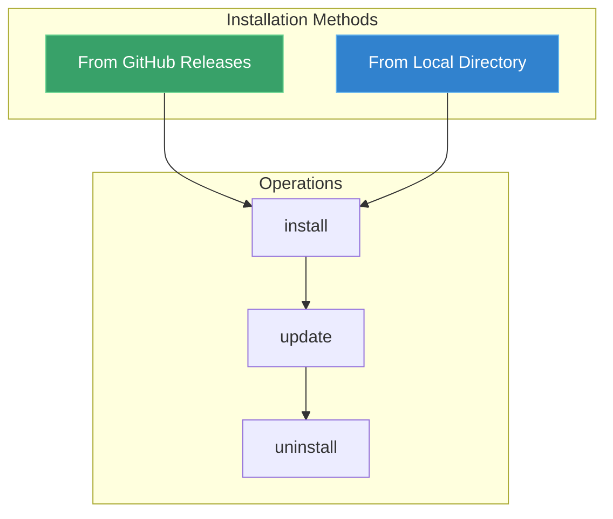

```rust
use rhinolabs_core::Installer;

let installer = Installer::new()
    .dry_run(false);

// Install from GitHub releases
installer.install().await?;

// Install from local directory
installer.install_from_local(Path::new("./rhinolabs-claude"))?;

// Update existing installation
installer.update().await?;

// Uninstall
installer.uninstall()?;
```

### settings.rs / instructions.rs / output_styles.rs

Configuration management.

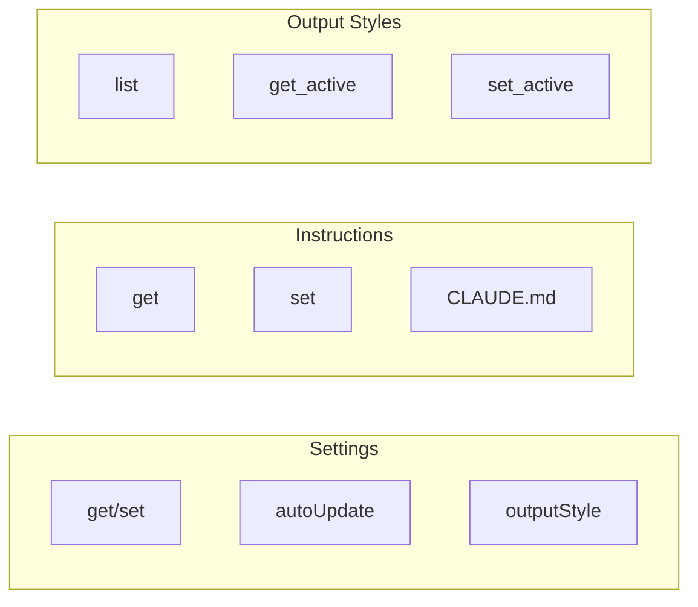

```rust
use rhinolabs_core::{Settings, Instructions, OutputStyles};

// Settings
let settings = Settings::get()?;
Settings::set("autoUpdate", serde_json::json!(true))?;

// Instructions
let content = Instructions::get()?;
Instructions::set("# My Instructions\n...")?;

// Output Styles
let styles = OutputStyles::list()?;
let active = OutputStyles::get_active()?;
OutputStyles::set_active("concise")?;
```

### mcp.rs

MCP server configuration.

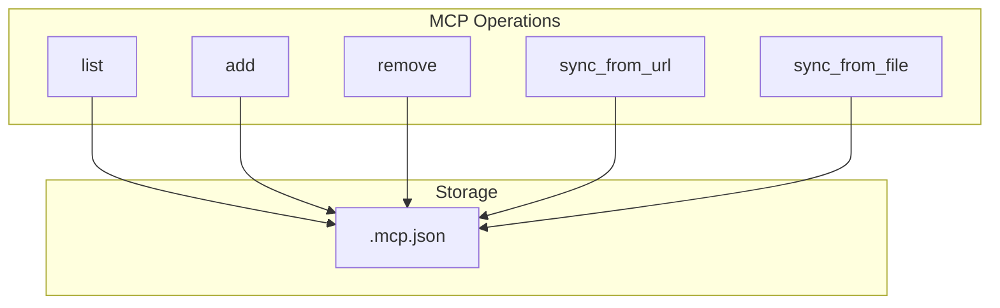

```rust
use rhinolabs_core::Mcp;

// List configured servers
let servers = Mcp::list()?;

// Add server
Mcp::add(McpServer {
    name: "my-server".to_string(),
    command: "node".to_string(),
    args: vec!["server.js".to_string()],
    env: HashMap::new(),
})?;

// Remove server
Mcp::remove("my-server")?;

// Sync from source
Mcp::sync_from_url("https://config.example.com/mcp.json").await?;
```

## Data Types

### Profile

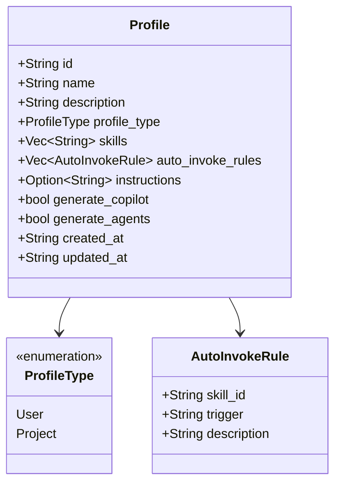

```rust
pub struct Profile {
    pub id: String,
    pub name: String,
    pub description: String,
    pub profile_type: ProfileType,
    pub skills: Vec<String>,
    pub auto_invoke_rules: Vec<AutoInvokeRule>,
    pub instructions: Option<String>,
    pub generate_copilot: bool,
    pub generate_agents: bool,
    pub created_at: String,
    pub updated_at: String,
}

pub enum ProfileType {
    User,      // Installs to ~/.claude/
    Project,   // Installs to project/.claude-plugin/
}

pub struct AutoInvokeRule {
    pub skill_id: String,
    pub trigger: String,      // "Editing .tsx/.jsx files"
    pub description: String,  // "React 19 patterns and hooks"
}
```

### Skill

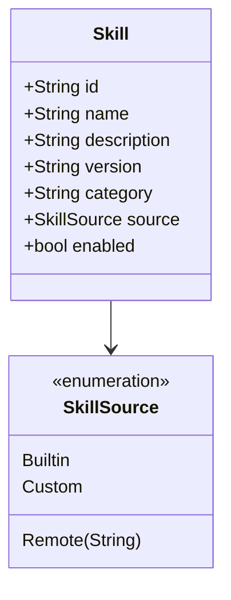

```rust
pub struct Skill {
    pub id: String,
    pub name: String,
    pub description: String,
    pub version: String,
    pub category: String,
    pub source: SkillSource,
    pub enabled: bool,
}

pub enum SkillSource {
    Builtin,
    Remote(String),
    Custom,
}
```

### Results

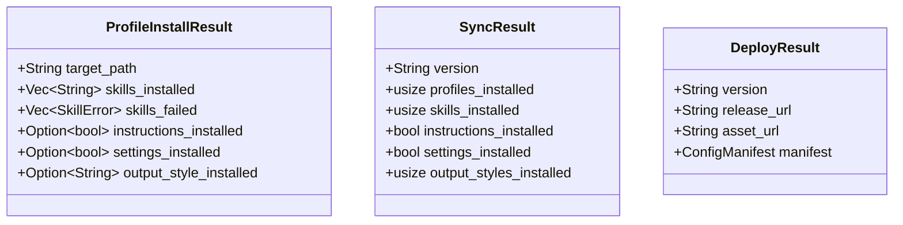

## Configuration Files

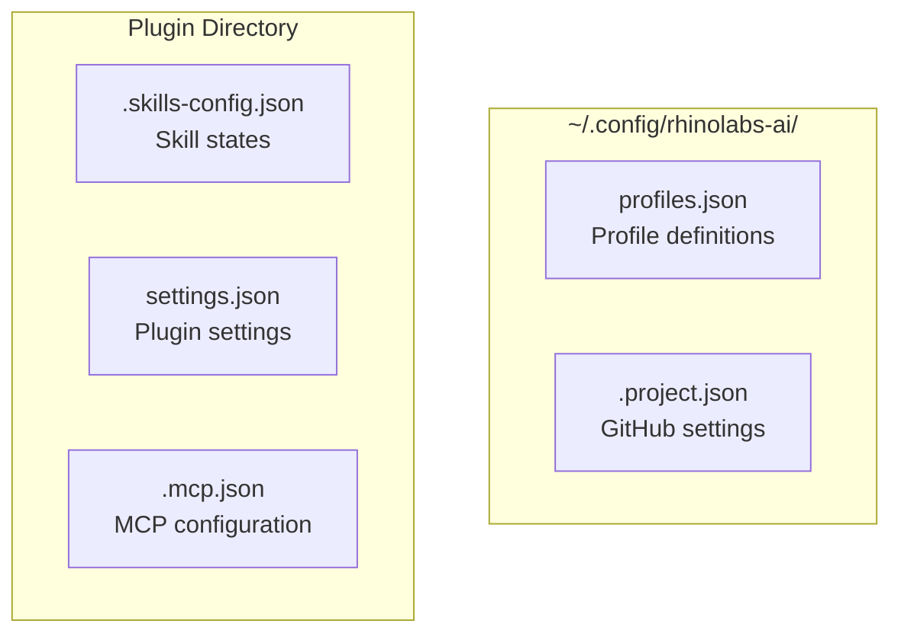

| File | Location | Purpose |
|------|----------|---------|
| `profiles.json` | `~/.config/rhinolabs-ai/` | Profile definitions |
| `.project.json` | Plugin directory | GitHub settings |
| `.skills-config.json` | Plugin directory | Skill states |
| `settings.json` | Plugin directory | Plugin settings |
| `.mcp.json` | Plugin directory | MCP configuration |

## Building

```bash
cargo build
```

## Testing

```bash
cargo test
```

## Usage in Other Crates

```toml
# Cargo.toml
[dependencies]
rhinolabs-core = { path = "../core" }
```

```rust
use rhinolabs_core::{Profiles, Skills, Deploy};
```

---

**Version**: 1.1.0
**Last Updated**: 2026-01-29
