# Rhinolabs Core

Shared Rust library providing core functionality for the Rhinolabs AI ecosystem.

## Overview

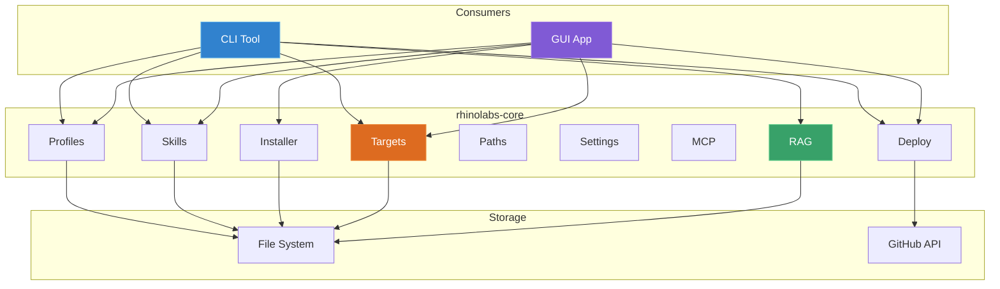

`rhinolabs-core` is used by both the CLI and GUI to ensure consistent behavior across all interfaces.

## Module Architecture

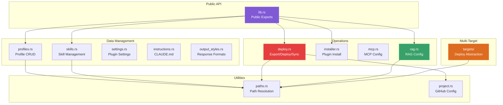

## Modules

### profiles.rs

Profile management, instructions, and installation.

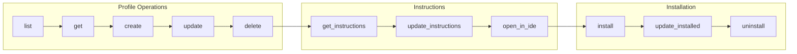

```rust
use rhinolabs_core::{Profiles, ProfileType, CreateProfileInput};

// List all profiles
let profiles = Profiles::list()?;

// Get specific profile
let profile = Profiles::get("react-stack")?;

// Create profile with skills (generates instructions template with auto-invoke table)
let profile = Profiles::create(CreateProfileInput {
    id: "my-profile".to_string(),
    name: "My Profile".to_string(),
    description: "Custom profile".to_string(),
    profile_type: ProfileType::Project,
    skills: vec!["react-19".to_string(), "typescript".to_string()],
    ..Default::default()
})?;

// Profile Instructions
let content = Profiles::get_instructions("react-stack")?;
Profiles::update_instructions("react-stack", "# New Instructions\n...")?;
let path = Profiles::get_instructions_path("react-stack")?;

// Install profile to path (defaults to ClaudeCode target)
let result = Profiles::install("react-stack", Some(Path::new("./project")), None)?;

// Install to specific targets
let targets = vec![DeployTarget::Amp, DeployTarget::ClaudeCode];
let result = Profiles::install("react-stack", Some(Path::new("./project")), Some(&targets))?;

// Update installed profile
let result = Profiles::update_installed("react-stack", Some(Path::new("./project")), None)?;

// Uninstall profile (None = remove all targets)
Profiles::uninstall(Path::new("./project"), None)?;

// Uninstall specific targets only
Profiles::uninstall(Path::new("./project"), Some(&[DeployTarget::Amp]))?;
```

**Instructions Generation:**
When creating a profile with skills, instructions are auto-generated with:
- Project context and rules
- Code standards template
- Auto-invoke table populated with assigned skills

### skills.rs

Skill management and retrieval.

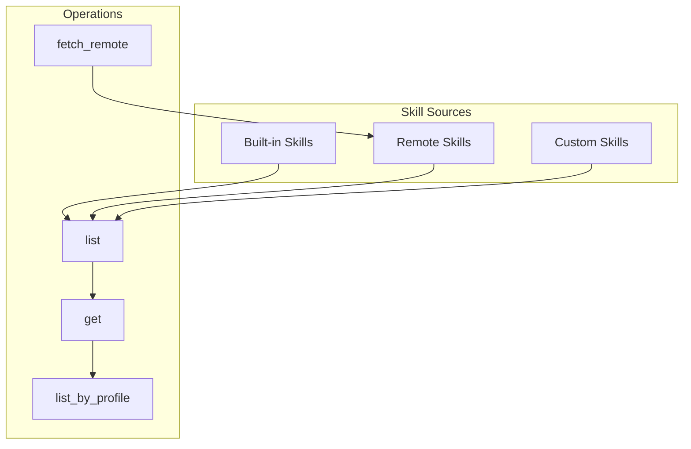

```rust
use rhinolabs_core::{Skills, SkillCategory, CreateSkillInput, UpdateSkillInput};

// List all skills
let skills = Skills::list()?;

// Get skill by ID
let skill = Skills::get("react-19")?;

// List skills by profile
let skills = Skills::list_by_profile("react-stack")?;

// Fetch remote skills
Skills::fetch_remote("anthropic-official")?;

// Create a new skill with category
let skill = Skills::create(CreateSkillInput {
    id: "my-skill".to_string(),
    name: "My Skill".to_string(),
    description: "Custom skill".to_string(),
    category: SkillCategory::Frontend,
    content: "# Instructions".to_string(),
})?;

// Update skill (including category)
Skills::update("my-skill", UpdateSkillInput {
    category: Some(SkillCategory::Testing),
    ..Default::default()
})?;

// Change skill category directly
Skills::set_category("my-skill", SkillCategory::Utilities)?;

// Get skill category
let category = Skills::get_skill_category("my-skill")?;
```

**Dynamic Categories:**
- User-defined categories are stored in `.skills-config.json` under `categoryMap`
- Categories in `categoryMap` take precedence over hardcoded built-in categories
- Available categories: `Corporate`, `Frontend`, `Testing`, `AiSdk`, `Utilities`, `Custom`

### deploy.rs

Configuration export, deploy, and sync.

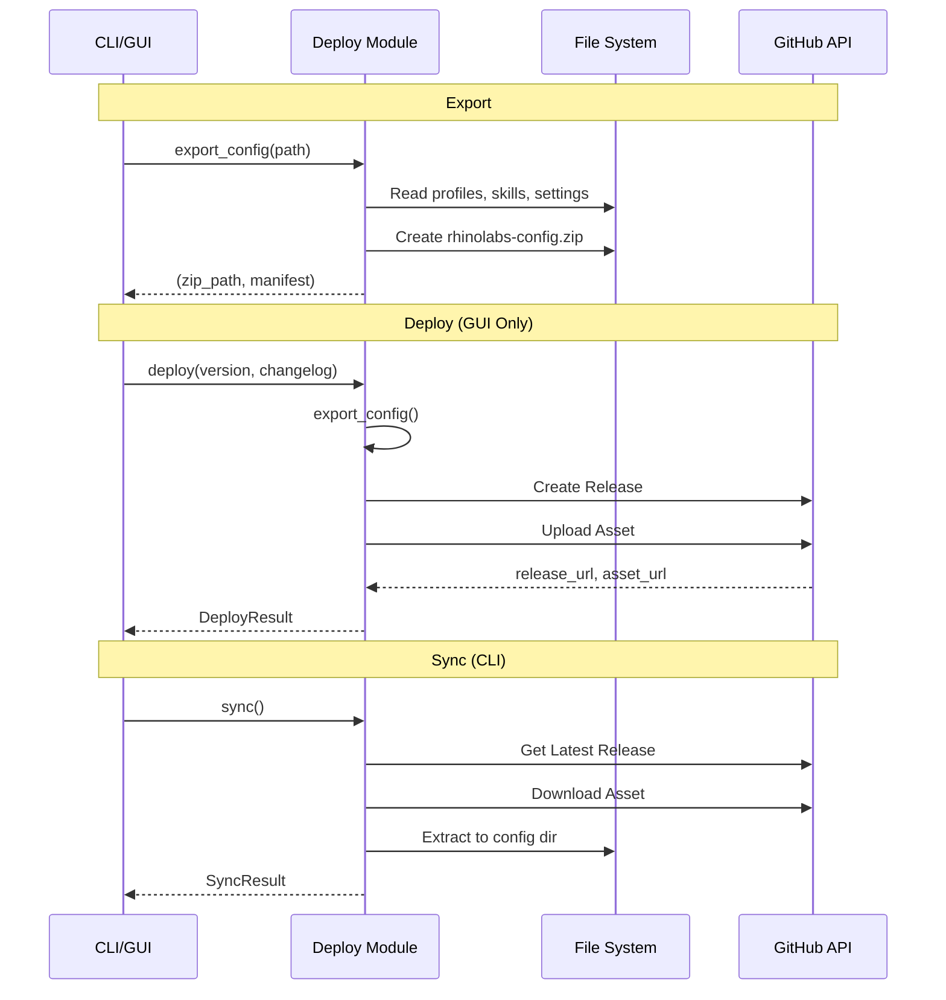

```rust
use rhinolabs_core::Deploy;

// Export configuration to zip
let (zip_path, manifest) = Deploy::export_config(Path::new("./output"))?;

// Deploy to GitHub (requires GITHUB_TOKEN)
let result = Deploy::deploy("1.0.0", "Release notes").await?;

// Sync from GitHub
let result = Deploy::sync().await?;
```

### paths.rs

Cross-platform path resolution.

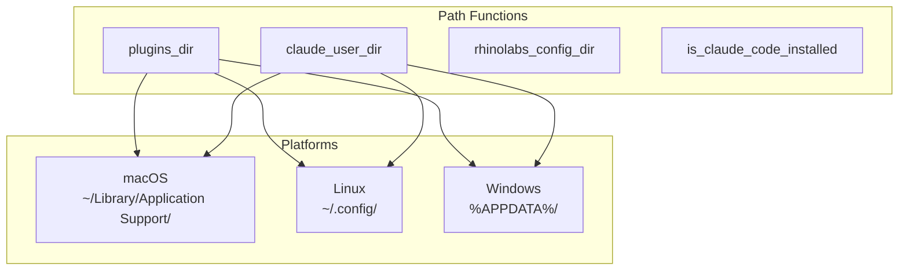

```rust
use rhinolabs_core::Paths;

// Plugin installation path
let plugin_path = Paths::plugins_dir()?;

// User Claude directory
let claude_dir = Paths::claude_user_dir()?;

// Rhinolabs config directory
let config_dir = Paths::rhinolabs_config_dir()?;

// Check if Claude Code is installed
if Paths::is_claude_code_installed() {
    // ...
}
```

### installer.rs

Plugin installation and updates.

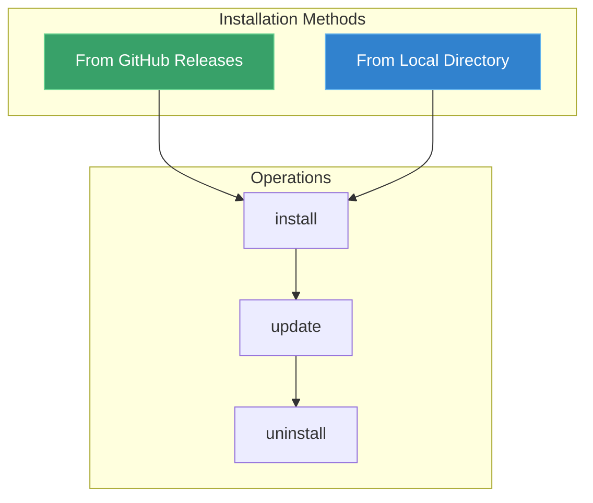

```rust
use rhinolabs_core::Installer;

let installer = Installer::new()
    .dry_run(false);

// Install from GitHub releases
installer.install().await?;

// Install from local directory
installer.install_from_local(Path::new("./rhinolabs-claude"))?;

// Update existing installation
installer.update().await?;

// Uninstall
installer.uninstall()?;
```

### settings.rs / instructions.rs / output_styles.rs

Configuration management.

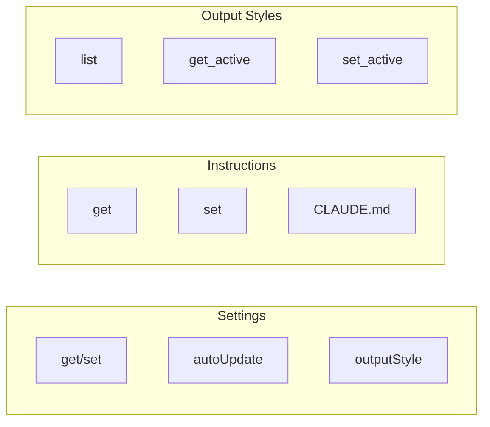

```rust
use rhinolabs_core::{Settings, Instructions, OutputStyles};

// Settings
let settings = Settings::get()?;
Settings::set("autoUpdate", serde_json::json!(true))?;

// Instructions
let content = Instructions::get()?;
Instructions::set("# My Instructions\n...")?;

// Output Styles
let styles = OutputStyles::list()?;
let active = OutputStyles::get_active()?;
OutputStyles::set_active("concise")?;
```

### mcp.rs

MCP server configuration.

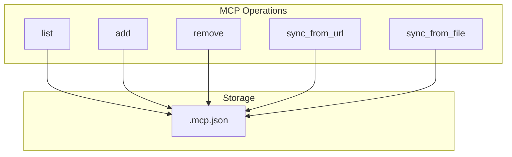

```rust
use rhinolabs_core::Mcp;

// List configured servers
let servers = Mcp::list()?;

// Add server
Mcp::add(McpServer {
    name: "my-server".to_string(),
    command: "node".to_string(),
    args: vec!["server.js".to_string()],
    env: HashMap::new(),
})?;

// Remove server
Mcp::remove("my-server")?;

// Sync from source
Mcp::sync_from_url("https://config.example.com/mcp.json").await?;
```

### rag.rs

RAG (Retrieval-Augmented Generation) local configuration management. All actual RAG operations are performed by the centralized MCP Worker.

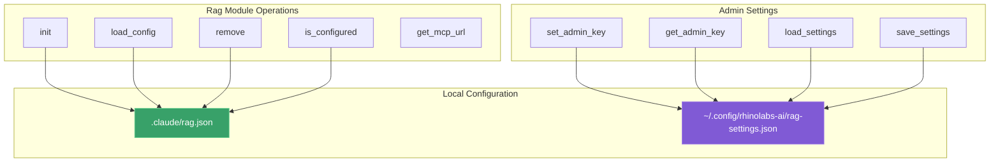

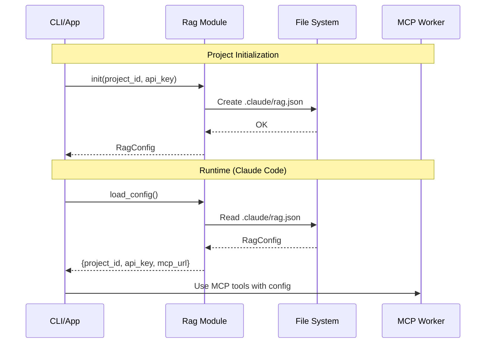

```rust
use rhinolabs_core::{Rag, RagConfig, RagSettings};

// Initialize RAG for a project (creates .claude/rag.json)
let config = Rag::init(Path::new("./my-project"), "project-id", "rl_api_key")?;

// Load existing configuration
let config = Rag::load_config(Path::new("./my-project"))?;

// Check if RAG is configured
if Rag::is_configured(Path::new("./my-project"))? {
    // ...
}

// Get MCP URL (returns custom or default)
let url = Rag::get_mcp_url(&config);

// Remove RAG configuration
Rag::remove(Path::new("./my-project"))?;

// Admin key management (for creating/listing API keys)
Rag::set_admin_key("admin_secret")?;
let admin_key = Rag::get_admin_key()?;

// Settings persistence
let settings = Rag::load_settings()?;
Rag::save_settings(&RagSettings {
    default_mcp_url: Some("https://custom.workers.dev".to_string()),
    admin_key: Some("my_admin_key".to_string()),
})?;
```

**Key Concepts:**

- **RagConfig**: Per-project configuration stored in `.claude/rag.json`
  - `project_id`: Unique identifier for the project
  - `api_key`: API key for authenticating with MCP Worker
  - `mcp_url`: Optional custom MCP Worker URL (uses default if not set)

- **RagSettings**: Global settings stored in `~/.config/rhinolabs-ai/rag-settings.json`
  - `default_mcp_url`: Override default MCP Worker URL
  - `admin_key`: Admin key for key management operations

**Note:** The Rag module only manages local configuration. All actual save/search operations are performed by the MCP Worker and accessed via Claude Code's MCP integration.

### targets/

Multi-target deployment abstraction layer. Provides traits and implementations for deploying skills, instructions, and MCP configuration to different AI coding assistants.

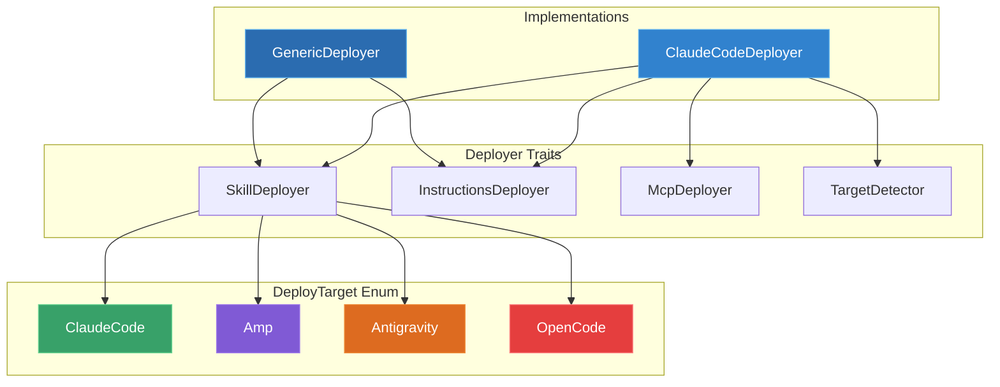

**Supported Targets:**

| Target | User Skills | Project Skills | Instructions | MCP Config |
|--------|------------|----------------|-------------|------------|
| Claude Code | `~/.claude/skills/` | `.claude/skills/` | `CLAUDE.md` | `.mcp.json` |
| Amp | `~/.config/agents/skills/` | `.agents/skills/` | `AGENTS.md` | `settings.json` |
| Antigravity | `~/.gemini/antigravity/skills/` | `.agent/skills/` | `GEMINI.md` | `config.json` |
| OpenCode | `~/.config/opencode/skills/` | `.opencode/skills/` | `opencode.json` | `opencode.json` |

```rust
use rhinolabs_core::{
    DeployTarget, TargetPaths, ClaudeCodeDeployer, GenericDeployer,
    SkillDeployer, InstructionsDeployer, McpDeployer, TargetDetector,
};

// Enumerate all targets
for target in DeployTarget::all() {
    println!("{}: installed={}", target, target.is_installed());
}

// Parse target from CLI string
let target: DeployTarget = "amp".parse().unwrap();
let prefix = target.project_skills_prefix(); // ".agents/skills"

// Resolve paths per target
let skills_dir = TargetPaths::user_skills_dir(DeployTarget::ClaudeCode)?;
let project_skills = TargetPaths::project_skills_dir(DeployTarget::Amp, project_path);
let config_dir = TargetPaths::project_config_dir(DeployTarget::Amp, project_path);

// Use ClaudeCodeDeployer (implements all 4 traits including McpDeployer)
let deployer = ClaudeCodeDeployer;
deployer.deploy_skill_project("react-19", &source, &project)?;
deployer.deploy_instructions_project("# Rules\n...", &project)?;

// Use GenericDeployer for any target (implements SkillDeployer + InstructionsDeployer)
let amp_deployer = GenericDeployer::new(DeployTarget::Amp);
amp_deployer.deploy_skill_project("react-19", &source, &project)?;
amp_deployer.deploy_instructions_project("# Rules\n...", &project)?;

// Create deployers for multiple targets at once
let deployers = GenericDeployer::for_targets(&[DeployTarget::Amp, DeployTarget::ClaudeCode]);

// Trait objects for multi-target dispatch
let deployers: Vec<Box<dyn InstructionsDeployer>> = vec![
    Box::new(ClaudeCodeDeployer),
    Box::new(GenericDeployer::new(DeployTarget::Amp)),
    Box::new(GenericDeployer::new(DeployTarget::Antigravity)),
];
```

**Module Structure:**

| File | Purpose |
|------|---------|
| `deploy_target.rs` | `DeployTarget` enum with serde, Display, FromStr, path helpers |
| `target_paths.rs` | `TargetPaths` static path resolver per target |
| `traits.rs` | `SkillDeployer`, `InstructionsDeployer`, `McpDeployer`, `TargetDetector` |
| `claude_code.rs` | `ClaudeCodeDeployer` implementing all 4 traits |
| `generic.rs` | `GenericDeployer` parameterized deployer for any target (SkillDeployer + InstructionsDeployer) |

## Data Types

### Profile

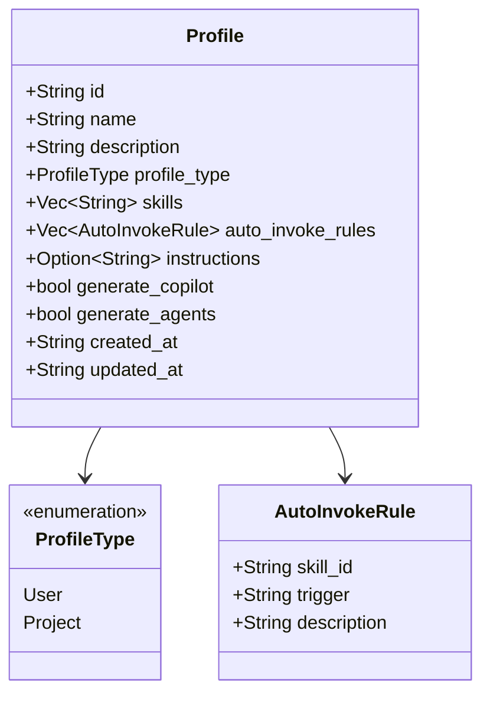

```rust
pub struct Profile {
    pub id: String,
    pub name: String,
    pub description: String,
    pub profile_type: ProfileType,
    pub skills: Vec<String>,
    pub auto_invoke_rules: Vec<AutoInvokeRule>,
    pub instructions: Option<String>,
    pub generate_copilot: bool,
    pub generate_agents: bool,
    pub created_at: String,
    pub updated_at: String,
}

pub enum ProfileType {
    User,      // Installs to ~/.claude/
    Project,   // Installs to project/.claude-plugin/
}

pub struct AutoInvokeRule {
    pub skill_id: String,
    pub trigger: String,      // "Editing .tsx/.jsx files"
    pub description: String,  // "React 19 patterns and hooks"
}
```

### Skill

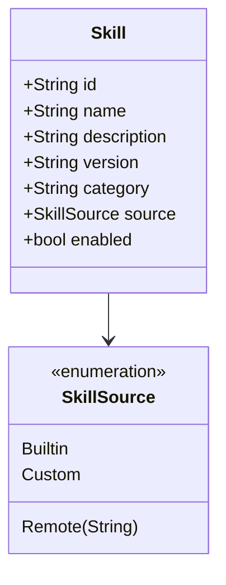

```rust
pub struct Skill {
    pub id: String,
    pub name: String,
    pub description: String,
    pub version: String,
    pub category: String,
    pub source: SkillSource,
    pub enabled: bool,
}

pub enum SkillSource {
    Builtin,
    Remote(String),
    Custom,
}
```

### Results

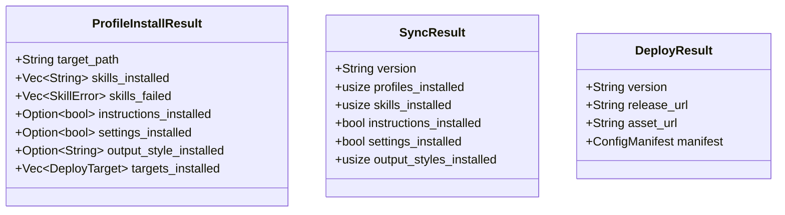

## Configuration Files

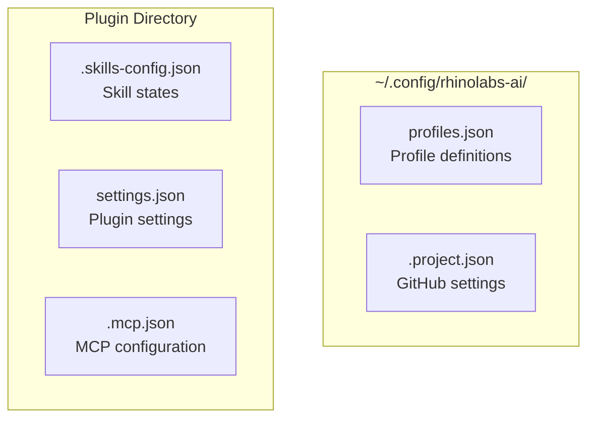

| File | Location | Purpose |
|------|----------|---------|
| `profiles.json` | `~/.config/rhinolabs-ai/` | Profile definitions |
| `.project.json` | Plugin directory | GitHub settings |
| `.skills-config.json` | Plugin directory | Skill states |
| `settings.json` | Plugin directory | Plugin settings |
| `.mcp.json` | Plugin directory | MCP configuration |

## Building

```bash
cargo build
```

## Testing

```bash
cargo test
```

## Usage in Other Crates

```toml
# Cargo.toml
[dependencies]
rhinolabs-core = { path = "../core" }
```

```rust
use rhinolabs_core::{Profiles, Skills, Deploy, DeployTarget, ClaudeCodeDeployer, GenericDeployer};
```

---

**Version**: 1.2.0
**Last Updated**: 2026-02-04
