# Rhinolabs AI GUI

Desktop application for managing the Rhinolabs AI plugin and team configuration.

## Overview

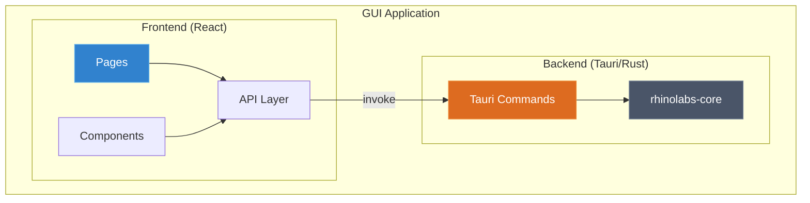

The GUI is designed for **lead developers** who need to:

- Manage skills and profiles (with integrated instructions)
- Configure MCP servers
- **Deploy configuration to GitHub** (GUI-only feature)
- Manage plugin settings

Team developers use the CLI for read-only operations (sync, profile install).

## Installation

### From Releases

Download the latest release for your platform:

- **macOS**: `rhinolabs-ai_x.x.x_x64.dmg`
- **Windows**: `rhinolabs-ai_x.x.x_x64-setup.exe`
- **Linux**: `rhinolabs-ai_x.x.x_amd64.AppImage`

### From Source

```bash
cd gui
pnpm install
pnpm tauri build
```

## Application Structure

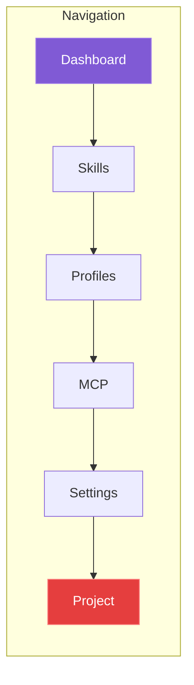

## Features

### Dashboard

Overview of plugin status and quick actions.

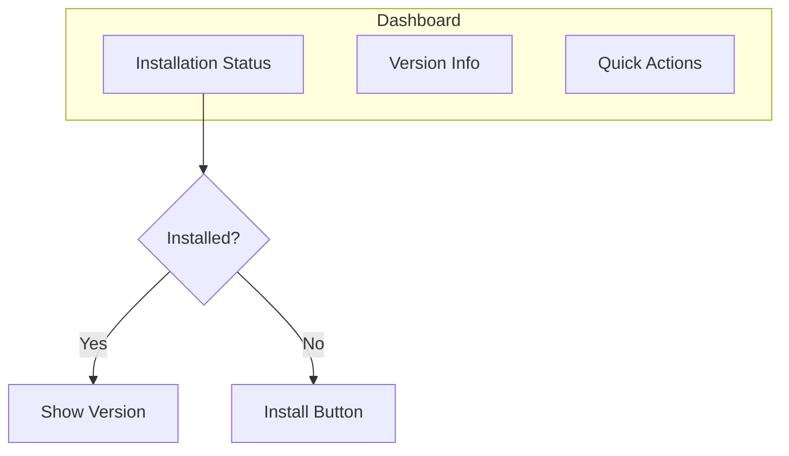

### Skills Management

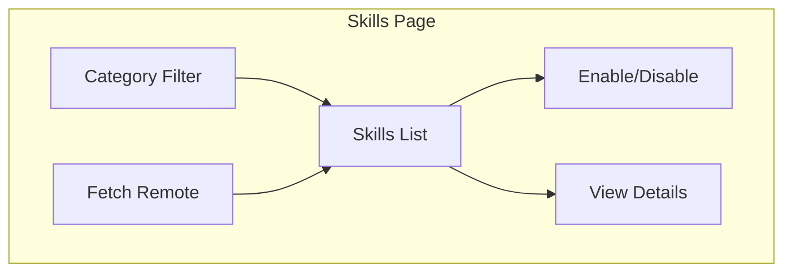

- Browse built-in and remote skills
- Enable/disable skills
- Fetch skills from remote sources
- View skill details and content

### Profiles Management

Profiles now have integrated instructions management - no separate Instructions page needed.

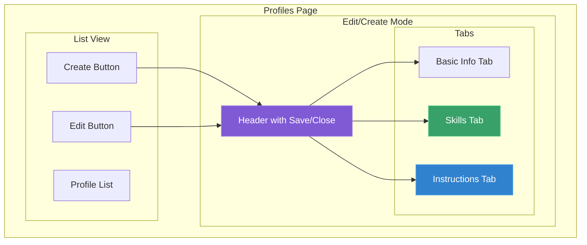

**Create/Edit Flow:**
1. **Basic Info**: ID, name, description
2. **Skills**: Assign skills with category filter (available during creation)
3. **Instructions**: View/edit in IDE (edit mode only)

**Key Features:**
- Skills can be assigned during profile creation
- Instructions template auto-generated with assigned skills in auto-invoke table
- Main Profile instructions = global CLAUDE.md (single source of truth)

### MCP Servers

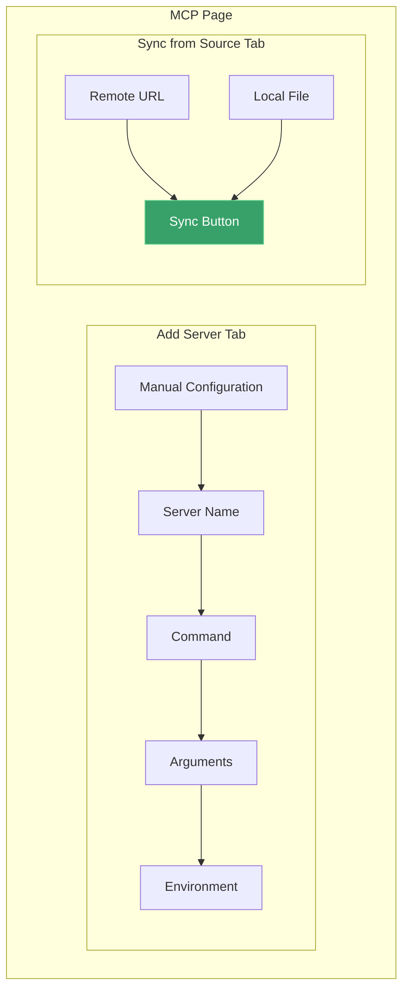

### Settings

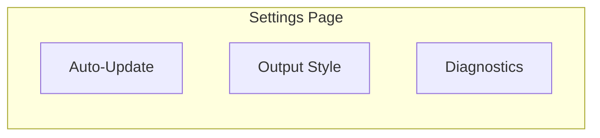

Note: CLAUDE.md instructions are now managed via Profiles → Main Profile → Instructions tab.

### Project & Deploy

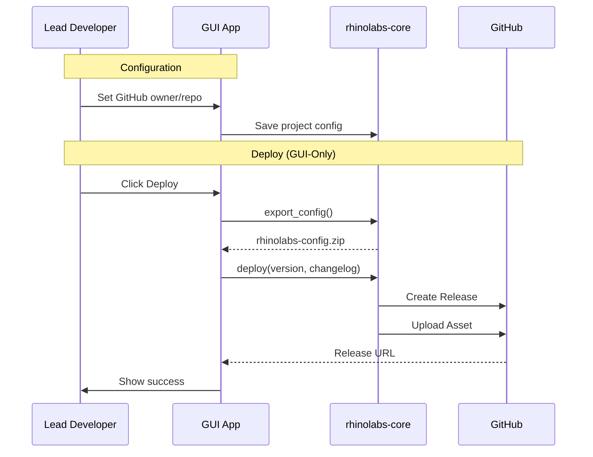

**Settings:**
- Configure GitHub owner/repo
- View current configuration

**Deploy (GUI-Only):**
- Export current configuration
- Deploy to GitHub releases
- Version management

## Tech Stack

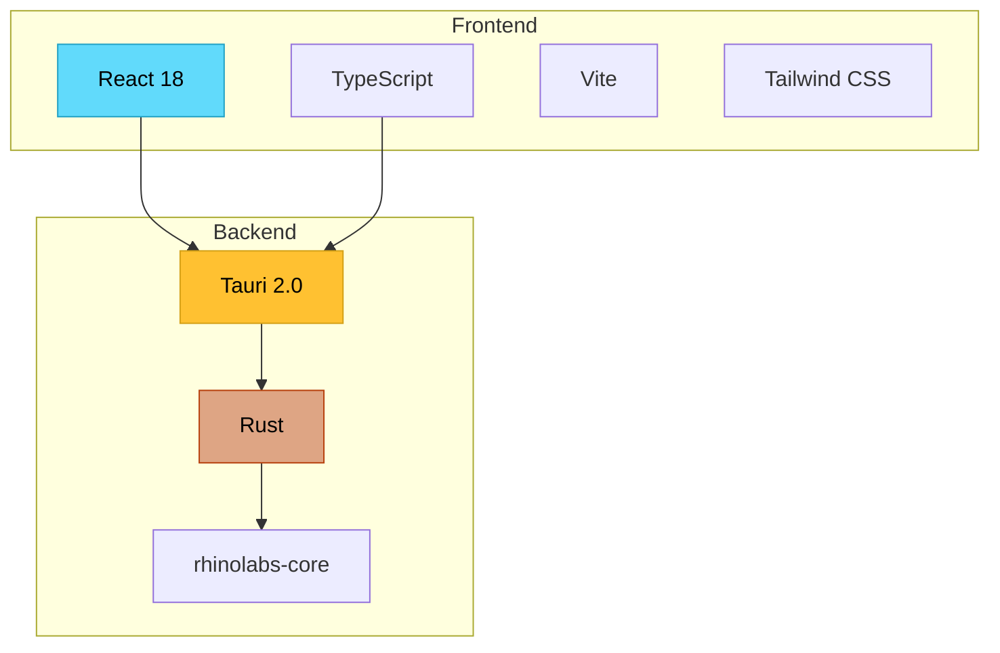

| Layer | Technology |
|-------|------------|
| Frontend | React 18 + TypeScript |
| Build | Vite |
| Backend | Tauri (Rust) |
| Styling | Tailwind CSS |
| Core Logic | rhinolabs-core (shared library) |

## Project Structure

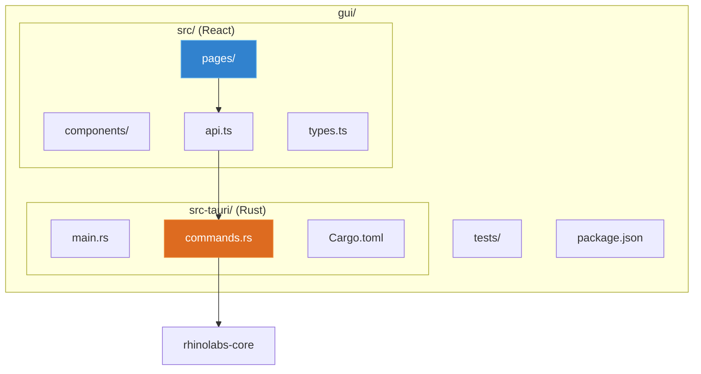

```
gui/
├── src/                    # React frontend
│   ├── pages/              # Page components
│   │   ├── Dashboard.tsx
│   │   ├── Skills.tsx
│   │   ├── Profiles.tsx
│   │   ├── Mcp.tsx
│   │   ├── Settings.tsx
│   │   └── Project.tsx
│   ├── components/         # Reusable components
│   ├── api.ts              # Tauri command bindings
│   ├── types.ts            # TypeScript types
│   └── App.tsx             # Main app component
├── src-tauri/              # Rust backend
│   ├── src/
│   │   ├── main.rs         # Entry point
│   │   ├── commands.rs     # Tauri commands
│   │   └── lib.rs          # Library exports
│   ├── Cargo.toml
│   └── tauri.conf.json     # Tauri configuration
├── tests/                  # E2E tests
│   └── e2e/
└── package.json
```

## Tauri Commands

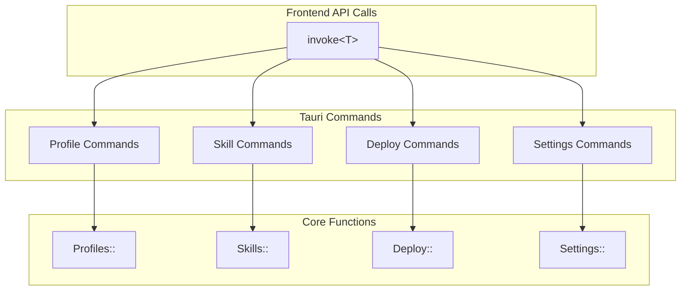

### Profiles

```typescript
// List profiles
const profiles = await invoke<Profile[]>('list_profiles');

// Get profile
const profile = await invoke<Profile>('get_profile', { id: 'react-stack' });

// Create profile (with skills - generates instructions template with auto-invoke table)
await invoke('create_profile', {
  input: {
    id: 'react-stack',
    name: 'React Stack',
    description: 'React 19 with TypeScript and Tailwind',
    skills: ['react-19', 'typescript', 'tailwind-4']  // Skills assigned during creation
  }
});

// Update profile
await invoke('update_profile', { id: 'react-stack', input: { ... } });

// Delete profile
await invoke('delete_profile', { id: 'react-stack' });

// Assign skills (for existing profiles)
await invoke('assign_skills_to_profile', {
  profileId: 'react-stack',
  skillIds: ['react-19', 'typescript']
});

// Get profile skills
const skills = await invoke<Skill[]>('get_profile_skills', { profileId: 'react-stack' });

// Profile Instructions
const content = await invoke<string>('get_profile_instructions', { profileId: 'react-stack' });
await invoke('open_profile_instructions_in_ide', { profileId: 'react-stack', ideCommand: 'code' });
```

### Skills

```typescript
// List skills
const skills = await invoke<Skill[]>('list_skills');

// Get skill
const skill = await invoke<Skill>('get_skill', { id: 'react-19' });

// Toggle skill
await invoke('toggle_skill', { id: 'react-19', enabled: true });

// Fetch remote skills
await invoke('fetch_remote_skills', { source: 'anthropic-official' });
```

### Deploy (GUI-Only)

```typescript
// Deploy to GitHub
const result = await invoke<DeployResult>('deploy_config', {
  version: '1.0.0',
  changelog: 'Release notes'
});

// Export configuration
const result = await invoke<ExportResult>('export_config', {
  outputPath: '/path/to/output'
});
```

## Security Model

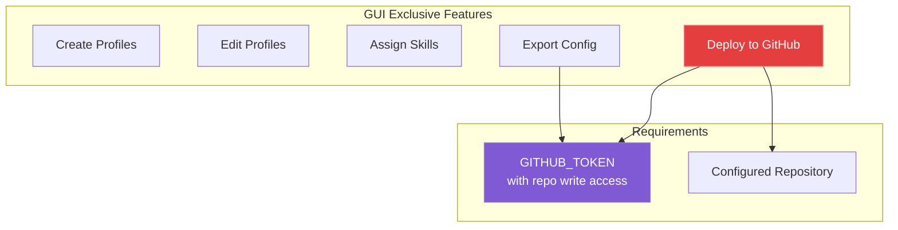

- Only lead developers with the GUI can publish configuration changes
- Team developers use CLI for read-only sync
- Requires `GITHUB_TOKEN` environment variable with repo write access

## Development

### Prerequisites

- Node.js 18+
- pnpm
- Rust 1.70+

### Setup

```bash
cd gui
pnpm install
```

### Development Mode

```bash
pnpm tauri dev
```

### Build

```bash
pnpm tauri build
```

### Testing

```bash
# E2E tests
cd tests
pnpm install
pnpm test
```

## Troubleshooting

### App Won't Start

```bash
# Check Tauri logs
cd gui
pnpm tauri dev

# Check for missing dependencies
cargo check -p rhinolabs-gui
```

### Deploy Failed

1. Verify `GITHUB_TOKEN` is set
2. Check repository permissions
3. Verify GitHub owner/repo in Project settings

### Skills Not Loading

```bash
# Check plugin installation
rhinolabs-ai status

# Verify skills directory
ls ~/.config/claude-code/plugins/rhinolabs-claude/skills/
```

---

**Version**: 1.1.0
**Last Updated**: 2026-01-29
