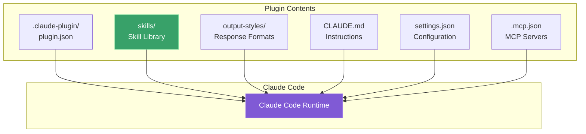
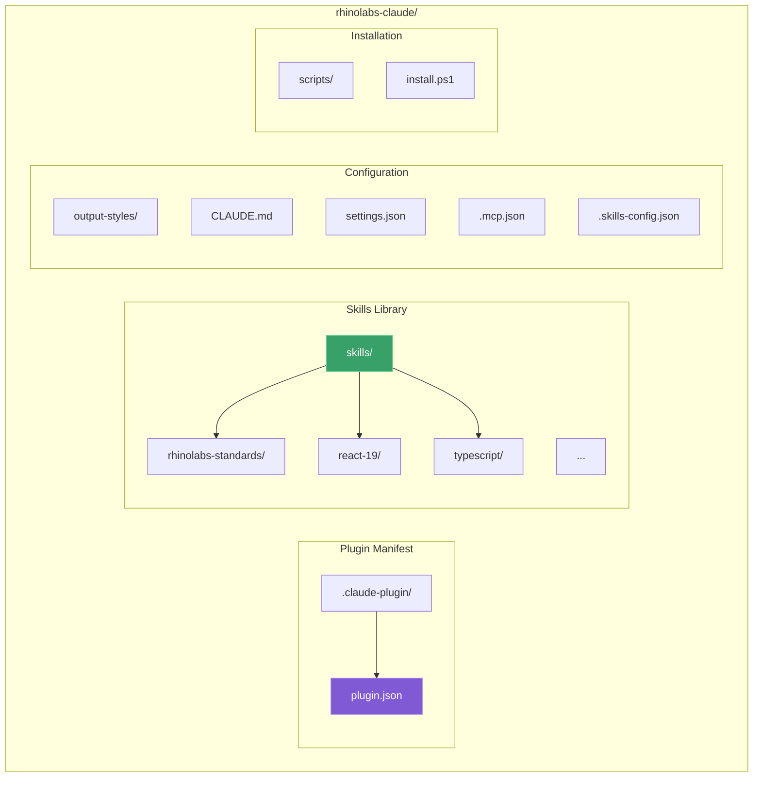
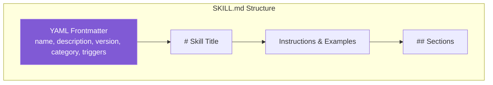
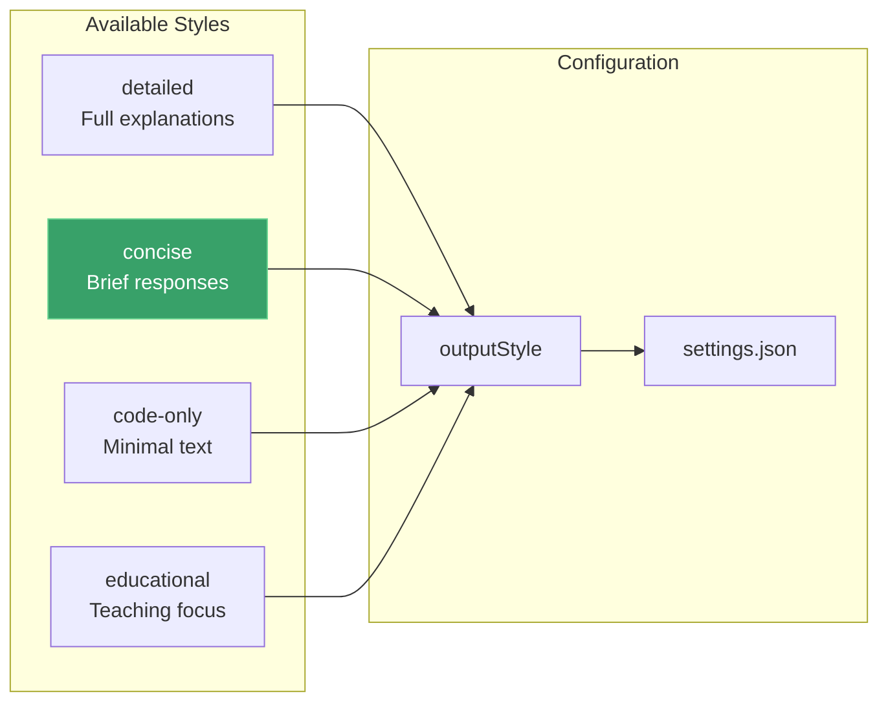
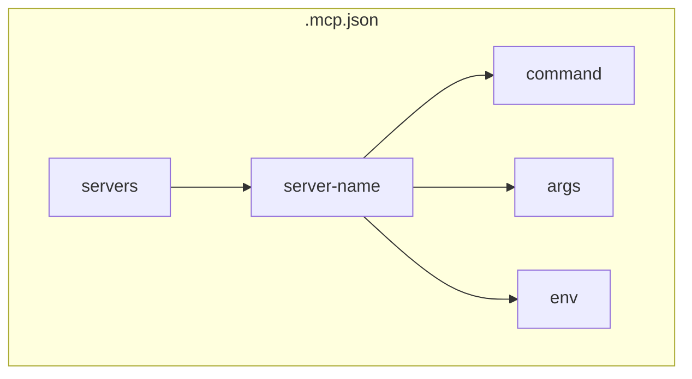
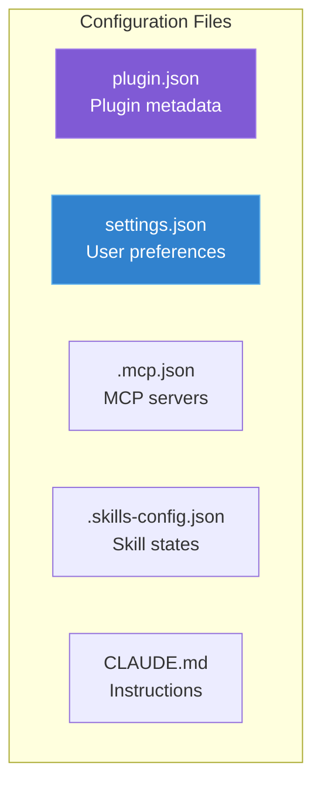
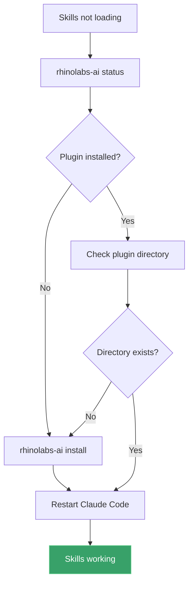

# Rhinolabs Claude Plugin

Base plugin for Claude Code with curated skills for consistent development standards.

## Overview



This plugin provides:

- **Skills**: Curated coding standards and best practices
- **MCP Configuration**: Pre-configured MCP servers
- **Output Styles**: Customizable response formats
- **CLAUDE.md**: Default instructions for Claude

## Installation

### Via CLI

```bash
rhinolabs-ai install
```

This downloads the plugin, installs it, and sets up all main profile skills in one step.

### Windows (PowerShell)

```powershell
cd rhinolabs-claude\scripts
.\install.ps1
```

### Manual

Copy the `rhinolabs-claude` folder to:

| OS | Path |
|----|------|
| macOS | `~/Library/Application Support/Claude Code/plugins/` |
| Linux | `~/.config/claude-code/plugins/` |
| Windows | `%APPDATA%\Claude Code\plugins\` |

## Plugin Structure



```
rhinolabs-claude/
├── .claude-plugin/
│   └── plugin.json           # Plugin manifest
├── .claude/
│   └── (placeholder)         # Claude config
├── skills/                   # Skill definitions
│   ├── rhinolabs-standards/
│   │   └── SKILL.md
│   ├── react-19/
│   │   └── SKILL.md
│   ├── typescript/
│   │   └── SKILL.md
│   └── ...
├── output-styles/            # Response formats
│   ├── detailed.md
│   ├── concise.md
│   └── ...
├── CLAUDE.md                 # Default instructions
├── settings.json             # Plugin settings
├── .mcp.json                 # MCP server config
├── .skills-config.json       # Skill states
└── scripts/
    ├── install.ps1           # Windows installer
    └── README.md             # Scripts documentation
```

## Skills

Skills are organized by category:

```mermaid
graph TB
    subgraph "Skill Categories"
        CORP[Corporate Standards]
        FRONTEND[Frontend Development]
        BACKEND[Backend Development]
        TESTING[Testing]
        AI[AI Integration]
        UTILS[Utilities]
    end

    subgraph "Corporate"
        STANDARDS[rhinolabs-standards]
        ARCH[rhinolabs-architecture]
        SEC[rhinolabs-security]
    end

    subgraph "Frontend"
        REACT[react-19]
        TS[typescript]
        TW[tailwind-4]
        ZOD[zod-4]
        ZUSTAND[zustand-5]
        NEXT[nextjs-15]
    end

    subgraph "Backend"
        DJANGO[django-drf]
        RUST[rust-patterns]
    end

    subgraph "Testing"
        STRATEGIES[testing-strategies]
        PW[playwright]
        PYTEST[pytest]
    end

    CORP --> STANDARDS
    CORP --> ARCH
    CORP --> SEC
    FRONTEND --> REACT
    FRONTEND --> TS
    FRONTEND --> TW
    BACKEND --> DJANGO
    BACKEND --> RUST
    TESTING --> STRATEGIES
    TESTING --> PW

    style CORP fill:#e53e3e,stroke:#fc8181,color:#fff
    style FRONTEND fill:#3182ce,stroke:#63b3ed,color:#fff
    style BACKEND fill:#dd6b20,stroke:#ed8936,color:#fff
    style TESTING fill:#38a169,stroke:#68d391,color:#fff
```



### Corporate Standards

| Skill | Description |
|-------|-------------|
| `rhinolabs-standards` | Corporate development standards |
| `rhinolabs-architecture` | Architecture patterns and principles |
| `rhinolabs-security` | Security requirements and best practices |

### Frontend Development

| Skill | Description |
|-------|-------------|
| `react-19` | React 19 patterns and best practices |
| `typescript` | TypeScript guidelines and patterns |
| `tailwind-4` | Tailwind CSS v4 utility patterns |
| `zod-4` | Zod v4 schema validation |
| `zustand-5` | Zustand v5 state management |
| `nextjs-15` | Next.js 15 App Router patterns |

### Backend Development

| Skill | Description |
|-------|-------------|
| `django-drf` | Django REST Framework patterns |
| `rust-patterns` | Rust idioms and best practices |

### Testing

| Skill | Description |
|-------|-------------|
| `testing-strategies` | Testing approaches and patterns |
| `playwright` | Playwright E2E testing |
| `pytest` | Python testing with pytest |

### AI Integration

| Skill | Description |
|-------|-------------|
| `ai-sdk-5` | Vercel AI SDK patterns |

### Utilities

| Skill | Description |
|-------|-------------|
| `skill-creator` | Create new skills with templates |

## Skill Format



Each skill is a Markdown file with YAML frontmatter:

```markdown
---
name: skill-name
description: When to activate this skill
version: 1.0.0
category: framework
triggers:
  - "keyword1"
  - "keyword2"
---

# Skill Title

Instructions for Claude...

## Section 1

Content...

## Section 2

Content...
```

### Frontmatter Fields

| Field | Required | Description |
|-------|----------|-------------|
| `name` | Yes | Skill identifier |
| `description` | Yes | When Claude should use this skill |
| `version` | No | Skill version (semver) |
| `category` | No | Category for filtering |
| `triggers` | No | Keywords that activate the skill |

## Output Styles



Customize how Claude formats responses:

| Style | Description |
|-------|-------------|
| `detailed` | Full explanations with examples |
| `concise` | Brief, to-the-point responses |
| `code-only` | Minimal explanation, maximum code |
| `educational` | Teaching-focused with context |

Set active style:

```bash
# Via GUI
Settings > Output Style > Select style

# Via settings.json
{
  "outputStyle": "concise"
}
```

## MCP Configuration



Pre-configured MCP servers in `.mcp.json`:

```json
{
  "servers": {
    "server-name": {
      "command": "npx",
      "args": ["-y", "server-package"],
      "env": {
        "API_KEY": "${API_KEY}"
      }
    }
  }
}
```

## CLAUDE.md

Default instructions loaded by Claude Code:

```markdown
# Instructions

## Rules
- Follow coding standards
- Write tests for new code
- Document public APIs

## Preferences
- Use TypeScript over JavaScript
- Prefer functional patterns
```

Customize via GUI (Settings > Instructions) or edit directly.

## Configuration Files



| File | Purpose |
|------|---------|
| `plugin.json` | Plugin metadata (name, version, author) |
| `settings.json` | User preferences |
| `.mcp.json` | MCP server configurations |
| `.skills-config.json` | Skill enabled/disabled states |
| `CLAUDE.md` | Claude instructions |

## Creating Custom Skills

```mermaid
flowchart TB
    START[Want to create a skill?]
    USE_CREATOR{Use skill-creator?}
    ASK_CLAUDE[Ask Claude:<br/>"Create a new skill for X"]
    MANUAL[Create manually]
    CREATE_DIR[mkdir skills/my-skill]
    CREATE_FILE[Create SKILL.md]
    ADD_FRONTMATTER[Add YAML frontmatter]
    ADD_CONTENT[Add instructions]
    RESTART[Restart Claude Code]
    DONE[Skill available]

    START --> USE_CREATOR
    USE_CREATOR -->|Yes| ASK_CLAUDE
    USE_CREATOR -->|No| MANUAL
    ASK_CLAUDE --> DONE
    MANUAL --> CREATE_DIR
    CREATE_DIR --> CREATE_FILE
    CREATE_FILE --> ADD_FRONTMATTER
    ADD_FRONTMATTER --> ADD_CONTENT
    ADD_CONTENT --> RESTART
    RESTART --> DONE

    style ASK_CLAUDE fill:#38a169,stroke:#68d391,color:#fff
    style DONE fill:#805ad5,stroke:#9f7aea,color:#fff
```

1. Use the skill-creator:

```bash
# In Claude Code, ask:
"Create a new skill for [technology/pattern]"
```

2. Or manually create:

```bash
mkdir skills/my-skill
cat > skills/my-skill/SKILL.md << 'EOF'
---
name: my-skill
description: When working with [context]
version: 1.0.0
category: custom
---

# My Skill

Instructions...
EOF
```

3. Restart Claude Code to load the new skill.

## Updating

### Via CLI

```bash
rhinolabs-ai update
```

## Uninstalling

### Via CLI

```bash
rhinolabs-ai uninstall
```

### Manual

```bash
# macOS
rm -rf ~/Library/Application\ Support/Claude\ Code/plugins/rhinolabs-claude

# Linux
rm -rf ~/.config/claude-code/plugins/rhinolabs-claude

# Windows (PowerShell)
Remove-Item -Recurse "$env:APPDATA\Claude Code\plugins\rhinolabs-claude"
```

## Troubleshooting

### Skills Not Loading



1. Verify plugin is installed:
   ```bash
   rhinolabs-ai status
   ```

2. Check plugin directory exists:
   ```bash
   ls ~/.config/claude-code/plugins/rhinolabs-claude/
   ```

3. Restart Claude Code

### MCP Servers Not Connecting

1. Check `.mcp.json` syntax:
   ```bash
   cat ~/.config/claude-code/plugins/rhinolabs-claude/.mcp.json | jq .
   ```

2. Verify required environment variables are set

3. Check server package is installed

### Permission Errors

```bash
# Fix permissions
chmod -R 755 ~/.config/claude-code/plugins/rhinolabs-claude
```

## Contributing Skills


1. Fork the repository
2. Create skill in `skills/` directory
3. Follow the skill format
4. Test with Claude Code
5. Submit pull request

---

**Version**: 1.0.0
**Last Updated**: 2026-01-28
